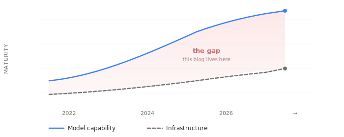

  

# The Demos Work. The Production Systems Don't.

AI models are years ahead of the infrastructure around them. Context management, supervision, tool orchestration, observability — the layer that turns a demo into a product is critically underbuilt. Like an airport with no air traffic control — a few flights work fine, try to run a thousand and nothing lands.

This blog is about that gap — the ideas, the architecture, and the patterns that can help close it.

  

---

## Start here

**Want the big picture?** [The AI Reality Check](./block-00/01-the-ai-reality-check.md) — where AI infrastructure actually stands, what's noise, and why the pattern is familiar.

**Want the thesis?** [The Win-Win Thesis](./block-00/04-the-win-win-thesis.md) — the operating premise for everything that follows.

**Want the architecture?** [Why AI Agents Waste Context](./block-01/01-why-agents-waste-context.md) — straight into the technical core.

**Short on time?** [Infrastructure Is the Only Moat](./block-01/07-infrastructure-is-the-only-moat.md) — the conclusion, and it stands on its own.

---

## What's inside

### [The State of Play](./block-00/00-index.md) — 5 articles, ~18 min

Where AI infrastructure actually stands, who's affected, and why the gap is fixable.

- [The AI Reality Check](./block-00/01-the-ai-reality-check.md) — the gap between demos and production, and why the pattern is familiar
- [The Infrastructure Bottleneck](./block-00/02-the-infrastructure-bottleneck.md) — silicon, power, cooling: the constraints software can't ignore
- [Two Worlds, One Problem](./block-00/03-two-worlds-one-problem.md) — hyperscalers vs. everyone else, same tech, radically different access
- [The Win-Win Thesis](./block-00/04-the-win-win-thesis.md) — why better architecture helps both sides simultaneously
- [Why I'm Writing This](./block-00/05-why-im-writing-this.md) — motivation, constraints, what adoption looks like

### [Building the Agentic Operating System](./block-01/00-index.md) — 7 articles, ~70 min

The technical core. What the missing infrastructure layer looks like and how to build it.

- [Why AI Agents Waste Context](./block-01/01-why-agents-waste-context.md) — shadow compaction, reference graphs, transactional context
- [Closing the Control Loop](./block-01/02-closing-the-control-loop.md) — supervisor, triage, runtime enforcement
- [The MCP Hub](./block-01/03-the-mcp-hub.md) — Kubernetes for MCP: capability routing, health checking, failover, reliable orchestration
- [The LLM Psychologist](./block-01/04-the-llm-psychologist.md) — health monitoring for models that drift under optimization pressure
- [It's Just Engineering Management](./block-01/05-just-engineering-management.md) — every component maps to how good managers already operate
- [Why Monolithic Models Won](./block-01/06-monolithic-models-vs-specialized-experts.md) — MoE, distillation, and when tiny specialists beat generalists
- [Infrastructure Is the Only Moat](./block-01/07-infrastructure-is-the-only-moat.md) — models swap in an hour; accumulated operational wisdom doesn't

### Architecture Over Optimization — *coming soon*

When the architecture is wrong, optimization is theater. Cases where the industry invests in making a broken design run faster — and what the alternative looks like.

- *The Inference Optimization That Shouldn't Exist* — most long-context inference optimization solves a problem that shouldn't arise

---

## About

Nothing here represents the views of any current or past employer.
Personal time, personal hardware, personal opinions.

- [About the Author](./common/01-about.md) — background, the full stack, the systems lens
- [Mission](./common/02-mission.md) — what this blog is, what it's not, who it's for
- [Current State & Future](./common/03-current-state.md) — how this is funded and what could change
- [How to Help](./common/04-how-to-help.md) — survey, feedback, ways to participate

---

## Contributing

This is a conversation, not a broadcast. Disagree with something — open an issue. Found a factual error — open a PR. The articles get better when readers push back.

---

## License

Content is licensed under [CC BY 4.0](https://creativecommons.org/licenses/by/4.0/). Share and adapt with attribution.
