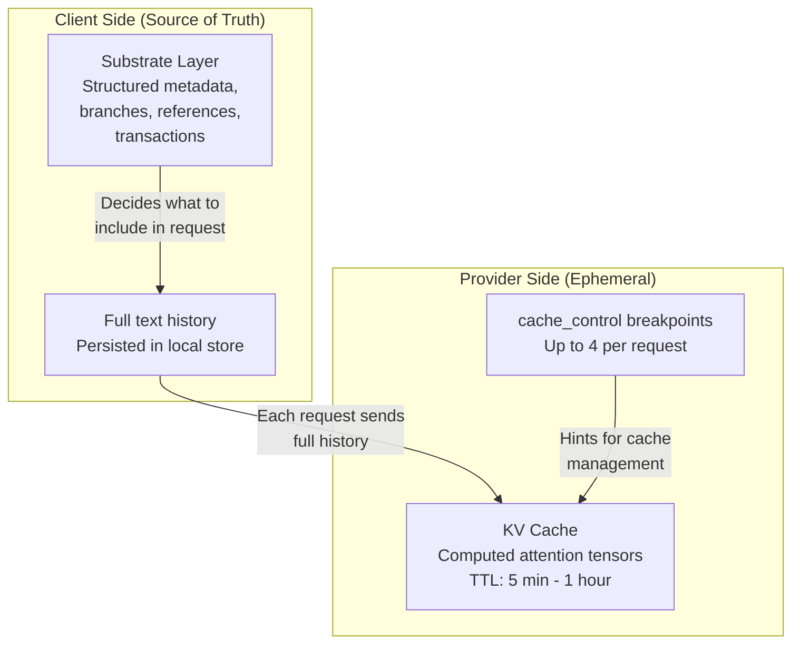
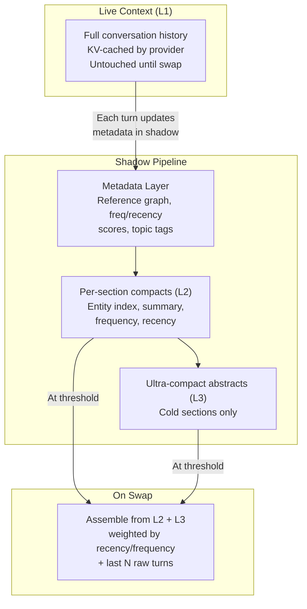
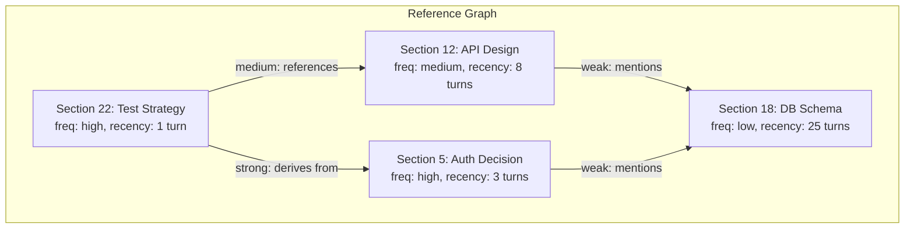
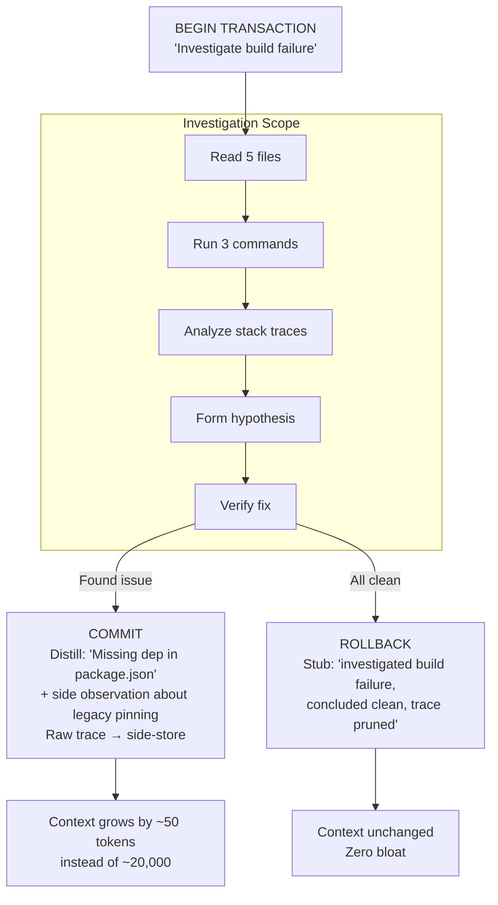
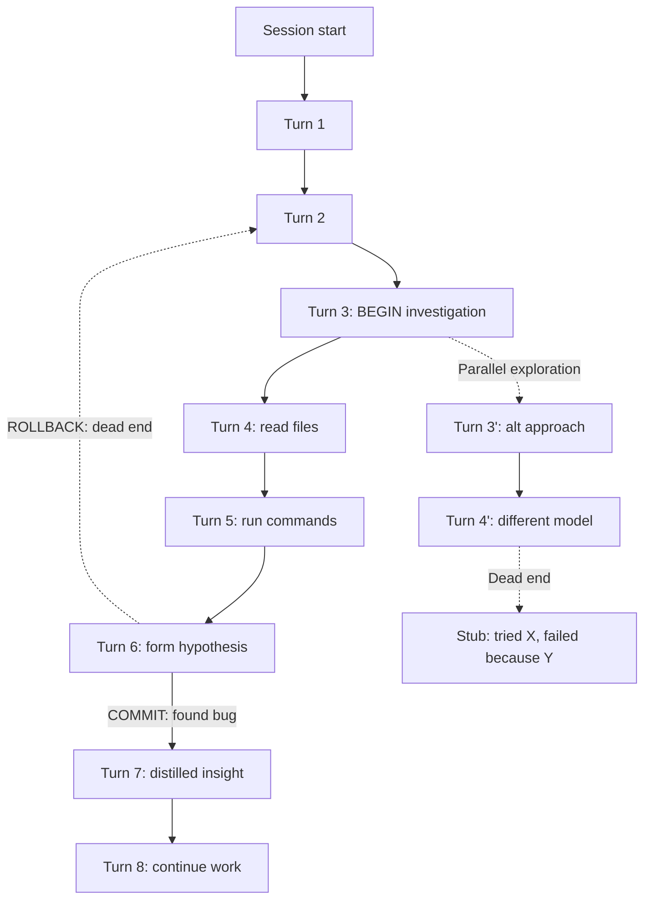

# Why AI Agents Waste Context (And the Shadow Architecture That Fixes It)

Every agentic tool today — Claude Code, Cursor, Aider (you name it) — hits the same wall. The context window fills up, the system pauses for minutes to compress everything, and quality degrades. The obvious question: why not run compaction in the background and swap instantly when needed?

There are real reasons this doesn't happen in production. But there's also a better architecture that sidesteps most of them.

## Where Things Stand Right Now

The industry has started moving. Claude Code now has three compaction modes — auto-compact (full LLM summarization triggered around 83.5% context utilization, using a subagent to produce a structured summary), micro-compact (a lighter pass), and context collapse. It also supports tool-result clearing and a memory system for cross-session persistence. Pi.dev has open-source auto-compaction with configurable reserve tokens, branch summarization for tree-based session navigation, and cumulative file tracking across compactions. These are real, shipping features.

But they're still coarse. Current implementations summarize conversation history into paragraph-level summaries with structured headings (Goal, Progress, Key Decisions, Next Steps). There's no entity-level reference tracking. No semantic knowledge graph linking sections by derivation strength. No per-section fidelity grading. No transactional commit semantics that would let an investigation produce a 50-token distillate instead of a 20K-token trace. The compaction is better than nothing — but it's still "compress everything when the bucket is full" rather than "manage memory like an operating system."

The architecture below describes what the next step looks like.

## Why Full Background Compaction Doesn't Exist Yet

Four constraints block naive background compaction:

**KV cache invalidation.** Modern inference on long contexts relies on prefix caching — the first N tokens are computed once and reused at 90%+ discount. If you rewrite early sections in the background, you invalidate everything below the edit point. The next turn becomes a full recomputation instead of a cheap cache hit plus delta.

**Speculative compute cost.** Compaction is an additional inference pass — sometimes several. Running it preventively for every session means paying for work that won't be needed if the session ends early. For providers with thin margins, this is non-trivial.

**Importance ranking requires knowledge of the future.** "Sort by importance" sounds like a utility operation, but importance is defined relative to the next query, which you don't have yet. A code section that looked incidental at turn 20 becomes critical context for a bug fix at turn 47. Static importance scoring systematically errs.

**Architectural complexity of async state mutation.** A turn-based agent with synchronous request/response is a simple state machine. A background worker that parallelly rewrites context requires versioning, locking, and race condition resolution. Reproducibility and debugging suffer.

## The Client Already Holds Everything

There's a foundational fact that makes all of the above constraints tractable, and it's worth stating explicitly because most discussions of agent context miss it entirely.

**The LLM API is stateless.** Every request to Anthropic, OpenAI, or any other provider includes the full conversation history. The server doesn't "remember" anything between requests — it receives text, tokenizes it, processes it, and returns output. The conversation state lives on the client.

**The KV cache is a performance feature, not storage.** When providers advertise "prompt caching," they mean computed attention tensors for token prefixes that match a recent request — with a TTL of minutes, sometimes up to an hour. The cache stores computed state, not text. It's useless without the client re-sending the same text. Cache hit means "we already computed attention for this prefix, skip the work" — but the input still comes from the client. The server doesn't remember your conversation. It optimizes repeated computation.

**The client is the source of truth.** Whether it's Claude Code writing transcript files to disk, Cursor maintaining a local conversation database, or a custom agent storing JSON logs — the text of everything that happened in a session lives on your machine. It has to. Without it, session resumption is impossible, because the next request needs the full history and there's nowhere to get it except the client.

This has a non-obvious but critical implication: **compaction is a client-side operation.** When context gets compressed, the client decides what to send in the next API request — a summary instead of the full early conversation. The original text stays in local storage. Compaction is choosing what to transmit, not deleting what happened. The 20K-token investigation trace that got distilled to 50 tokens for the API request? The full trace is still on disk, available for retrospective analysis, branching, or recovery.

Why this matters for the architecture: it means the substrate described below — the shadow pipeline, the reference graph, the transaction semantics — doesn't require any provider cooperation. It's a structured layer over what the client already has. Metadata, branches, references, transaction boundaries, attribution — these organize existing client-side storage into something richer than a raw chat log. The provider sees only what you choose to send. Selective commit, role-bounded context views, hierarchical compaction, tree branching — all of these work because the stateless API contract gives the client full control over what enters the context on every request.

The stateless contract is a feature, not a limitation. It doesn't conflict with any of the substrate's logic. It enables it.

## Shadow Context: Don't Touch the Live Prefix

The key insight: **don't modify the live context at all.** Maintain a parallel shadow copy that's continuously compressed, ready to swap in when the threshold hits.

This is speculative execution for compaction — like CPU branch prediction. Pre-compute the likely result so the swap is instant. The live prefix stays untouched. Provider caching works normally until the swap moment.

The key economic trick: compaction still needs an LLM, but it doesn't need the expensive one. A cheap cloud-tier model or a local 7-13B model running on idle compute handles paragraph summarization just fine — the frontier model doing primary reasoning never touches compaction work. This two-tier separation is what makes the economics work. The compaction model can even be a quantized 1.5-3B specialist trained specifically for summarization, running at hundreds of tokens per second on consumer hardware.

This produces a three-level hierarchy:

| Level | Contents | Fidelity | Compute |
|---|---|---|---|
| **L1** | Untouched live prefix, provider KV-cached | Full | Borne by provider |
| **L2** | Per-section compacts with entity index, summary, frequency, recency | High | Cheap model (local or cloud tier) |
| **L3** | Ultra-compact abstracts for cold sections | Minimal | Negligible |

Hot sections stay at full fidelity. Cold sections degrade to abstracts. This is working-set-aware context management — the same principle as LFU/LRU page replacement in operating systems, applied to semantic segments instead of memory pages. The frequency and recency scores that the shadow pipeline annotates on each section are structurally identical to the reference counters that a page replacement algorithm uses to decide which pages stay in RAM and which get paged out. The analogy is exact because the underlying property is the same: **temporal and spatial locality in dialogue is real**. An agent following a plan or debugging a specific code area accesses the same knowledge repeatedly, just as a running process touches the same memory regions. The L1/L2/L3 hierarchy mirrors the CPU cache hierarchy (L1 register, L2 SRAM, L3 DRAM) for the same reason — locality makes tiered storage work.

### Section Boundary Detection: Slicing the Conversation for Compaction

The shadow pipeline compresses context per-section — each section being a contiguous run of turns about the same topic or activity: the auth investigation, the test debugging, the API design discussion. But before it can compress a section, it needs to know where one section ends and the next begins.

This is a slicing problem. A 50-turn agent session isn't one monolithic topic — architecture discussion interleaves with code review, debugging, tangents, and context switches. The agent reads a file to understand the auth flow, then gets pulled into a failing test, then comes back to auth. Naive slicing — "every 10 turns is a section" — produces garbage: a section that starts mid-debug and ends mid-design review.

The pragmatic approach is **incremental segmentation**. At each turn, the cheap model that's already running for compaction answers one additional question: "continuation of the current topic, or shift?" This is a binary classification that small models handle well. The answer doesn't slice the conversation — it annotates a boundary probability on the turn. Section boundaries accumulate as a side effect: when enough consecutive "shift" annotations cluster, a boundary is recorded.

This is deliberately less sophisticated than semantic clustering over the full turn history. Clustering would produce cleaner slices, but it requires reprocessing past turns every time the agent adds one — compounding compute for marginal improvement. Incremental segmentation makes a locally optimal decision at each turn and accepts that some boundaries will be slightly off. The reference graph in the next section compensates: a section that was split across a real topic continuity just gets two reference nodes with a strong edge between them. The system degrades gracefully.

This is engineering dirt — the unglamorous part that doesn't make diagrams but determines whether the architecture works in practice. The clean version would be "we detect topic boundaries automatically." The honest version is "we make a cheap local guess at every turn and let the downstream structures absorb the errors."

## The Reference Graph: Garbage Collection for Context

Sections reference each other. Compacting one section can invalidate references from others. The solution: maintain a reference graph with GC semantics.

| Edge Type | Semantics | Effect on Target |
|---|---|---|
| **Strong** | Derivation dependency | Keep at full fidelity |
| **Medium** | Reference / citation | Moderate fidelity acceptable |
| **Weak** | Passing mention | Degradation allowed |

Unreachable sections get aggressively compacted or dropped. Edge weights update automatically as the cheap model annotates entity mentions per turn. This is essentially mark-and-sweep GC over semantic segments.

Before swap, L1 is still alive — any incorrectly compacted section can be rehydrated from the original. Loss only occurs at swap time, and even then, pruned sections leave stubs: "Investigated X at turn Z, pruned, recoverable."

## Selective Commit: The Most Powerful Operation

Shadow compaction and reference graphs manage context after it's formed. But the most powerful operation attacks bloat at the source.

An agent investigating a build failure might read multiple files and run several commands, accumulating thousands of tokens of output. The actual insight: "missing dependency in package.json." For every useful insight, there are 20K tokens of file dumps, intermediate reasoning, and rejected hypotheses.

Context grows as accumulated knowledge — **logarithmic by insights discovered, not linear by turns taken.**

| Approach | Context Growth | 50-turn session |
|---|---|---|
| Naive | Linear by turns | ~200K tokens |
| With compaction | Sublinear, post-hoc | ~80K tokens |
| Selective commit | Logarithmic by insights | ~5K tokens |

On a long session, the difference is not in percentages but in orders of magnitude.

### Validating the Distillation

A cheap model that distills 20K tokens into 50 might get it wrong — and you won't know until downstream reasoning breaks. The solution is straightforward: before the swap, **sample-test the compact**. The cheap model receives the compacted section and tries to answer 2-3 questions that the original section should answer. The answers are compared with the original via embedding similarity. High overlap: the compact captured the important content. Low confidence: the section is marked "hold higher fidelity" or re-compacted with a different prompt.

The cost is manageable — a few extra inference calls per section on idle compute. The benefit is catching distillation failures before they propagate into the active context, where they're much harder to detect and correct.

## The Context Tree: Git for Conversation State

Selective commit operates on individual investigation scopes. Shadow compaction maintains a parallel compressed copy. But there's a structural piece underneath both that the article hasn't described yet — and it's the piece that makes the rest of the agentic OS possible.

The client already holds the full text of every session. Right now that text lives as a linear chat log — one message after another, with compaction occasionally replacing old turns with summaries. What's needed is a **versioned, branching tree of conversation state** — essentially Git semantics applied to context.

Every turn creates a new node. Mutations — compaction, swap, rollback — create branches. The reference graph from sections sits as a separate layer on top. Content-addressed storage (like Git) deduplicates unchanged sections, so storing dozens of megabytes per session is trivial.

This isn't a new concept on top of selective commit — selective commit *operates on* the context tree. When an investigation commits, the tree gains a branch point: the pre-investigation state remains accessible, the distilled insight becomes the new head, and the raw investigation trace lives in a side-branch that can be rehydrated if needed. When an investigation rolls back clean, the dead-end branch collapses to a thin stub: "tried X, failed because Y." The path isn't lost as a negative example for future navigation, but it doesn't occupy space in the active context.

Dead-end pruning is what prevents combinatorial explosion. Without it, every exploration path preserved indefinitely would make the tree unwieldy. With it, the tree grows in proportion to useful knowledge — the same logarithmic growth that selective commit produces at the operation level.

The context tree matters beyond this article because it's what the supervisor (described in the [next article](./02-closing-the-control-loop.md)) queries for retrospective analysis. Without it, the supervisor can only see the last N turns of a linear log. With it, the supervisor can traverse the full history of what was tried, what worked, what failed, and why — across sessions, across branches, across different models' attempts at the same problem. The tree is the substrate on which observation, pattern detection, and learning all depend.

## The Pragmatic Starting Point

These four ideas — selective commit, context tree, shadow compaction, reference graph — form the foundation of agent context management. They can be built independently and incrementally. Selective commit can be prototyped first, before the full architecture: declared transaction boundaries in the system prompt, a cheap model for distillation on commit, and branch storage. This extracts the highest-value piece — controlled context growth — with minimal engineering. The context tree grows naturally underneath: every commit and rollback creates structure in the client-side storage that was already there.

## Expected Outcomes: What You Get at Each Stage

The architecture is incremental. Each layer compounds on the previous one. Quick recap of what each stage adds:

- **Baseline** — How every mainstream agent tool works today: raw conversation history accumulates linearly, compaction fires as an emergency brake when the context window is nearly full, and a single frontier model handles everything.
- **+ Selective Commit** — The agent declares transaction boundaries ("BEGIN: investigate build failure"). On commit, a cheap model distills the investigation into a one-line insight. On rollback, the entire trace is replaced with a stub. Context grows by insights, not by turns. Prototyped in days with system-prompt instructions and a local 3-7B model.
- **+ Shadow Compaction, Reference Graph & Context Tree** — A parallel shadow copy of the conversation is continuously compressed in the background by a cheap model, ready to swap in instantly when needed. A reference graph with GC semantics tracks which sections depend on which, so hot sections stay at full fidelity while cold sections degrade gracefully. The context tree versions every state change, enabling rollback, branching, and cross-session retrospective analysis. Compaction becomes proactive instead of reactive.

Here's what the ROI looks like at each stage for a typical 50-turn agent session:

| Metric | Baseline (current tools) | + Selective Commit only | + Shadow Compaction, Ref Graph & Context Tree |
|---|---|---|---|
| **Context at turn 50** | ~200K tokens (raw) | ~5K tokens (distilled) | ~5K tokens (maintained proactively) |
| **Compaction pause** | Minutes, full-stop, lossy | Minutes (but 40x less frequent) | Near-zero (pre-computed swap) |
| **Tokens wasted on dead-end traces** | ~80% of context | Near-zero (rolled back) | Near-zero (rolled back + GC'd) |
| **API cost per long session** | $5–20 (frontier model for everything) | $2–8 (frontier for reasoning only) | $1–4 (cheap model does compaction) |
| **Session reliability** | Degrades past turn 20–30 | Stable through turn 50+ | Stable through turn 100+ |
| **Recovery from mistakes** | Full session restart | Rollback to last commit point | Rollback + rehydrate from shadow |
| **Engineering effort** | — | Days (prototype) | Weeks (working system) |
| **Models required** | 1 frontier | 1 frontier + 1 cheap local | 1 frontier + 1 cheap local |

**The starting point alone** — selective commit with a cheap model — reduces context from ~200K to ~5K tokens and cuts API costs by 60–80%. That's days of engineering for the single highest-leverage improvement in the entire architecture.

**Adding shadow compaction, the reference graph, and the context tree** makes the system proactive instead of reactive: compaction is pre-computed, the swap is instant, important context is never accidentally lost, and the full history remains traversable for retrospective analysis. The three together turn a tool that degrades past turn 20 into one that stays stable through turn 100+ — and remembers everything that happened along the way.

The ultimate goal isn't better compaction of an already-overflowed context. It's making overflow a rare edge case. When selective commit distills investigations to their insights, and the shadow pipeline pre-compresses everything in the background — the context fill rate drops so low that the swap almost never triggers. Compaction becomes a safety net, not a routine operation. The system manages memory the way a well-tuned OS does: the page fault handler exists, but a well-designed workload rarely hits it.

But managing context is only the foundation. Who watches the agent itself?

---

*Part of [Building the Agentic Operating System](./00-index.md). Next: [Closing the Control Loop](./02-closing-the-control-loop.md)*
