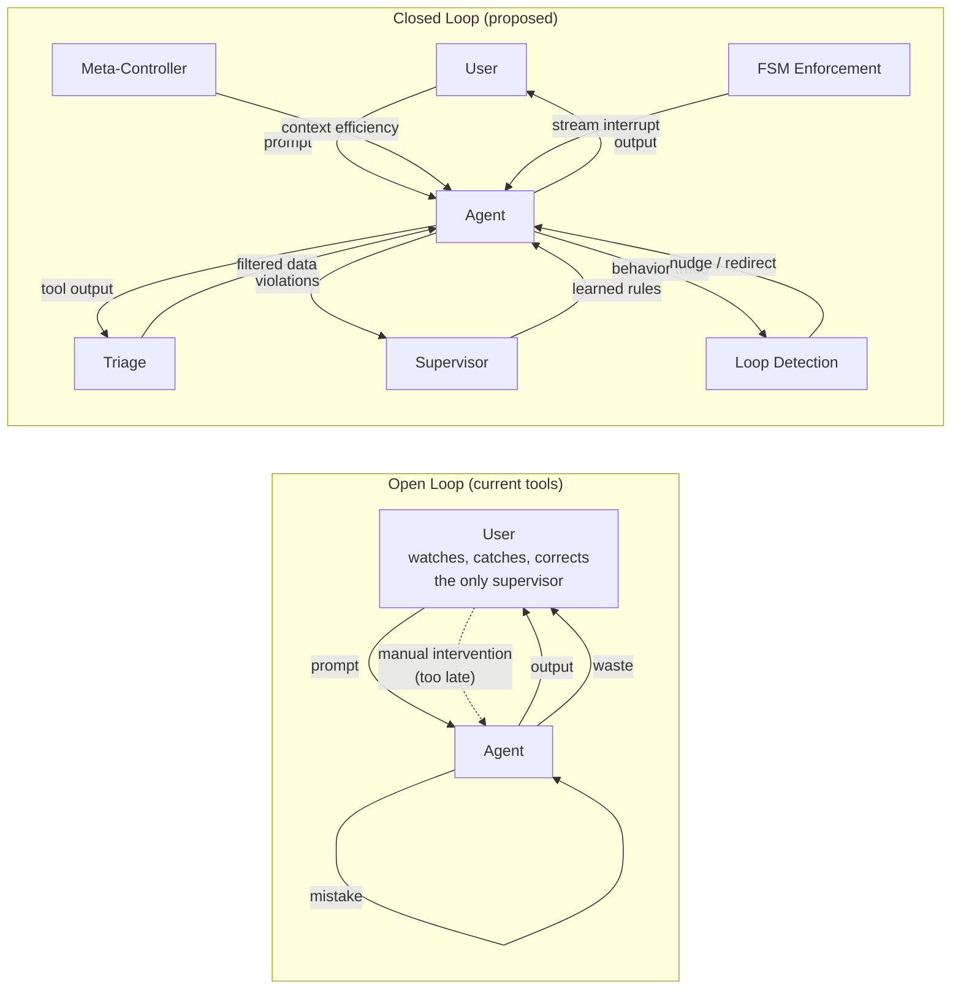
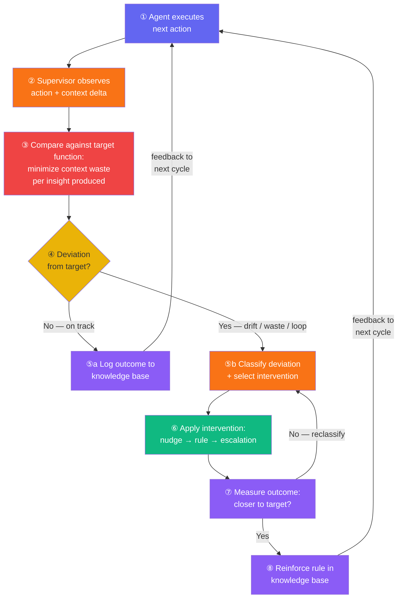
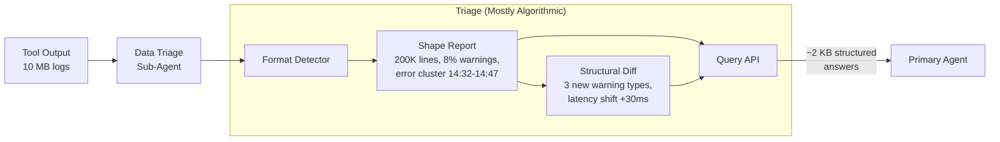
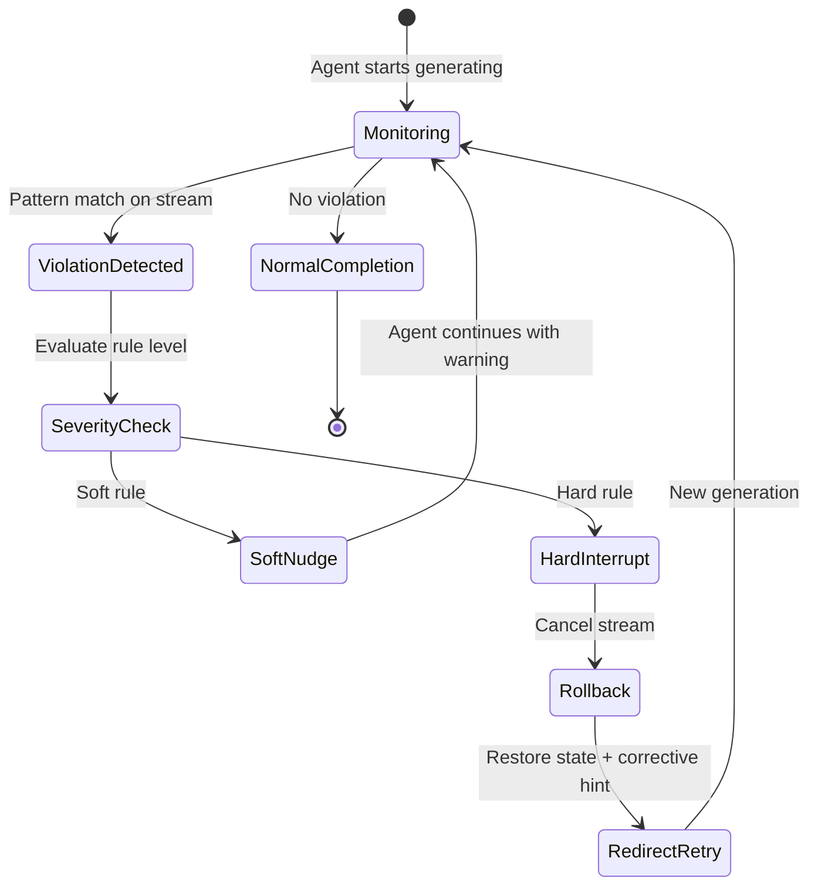
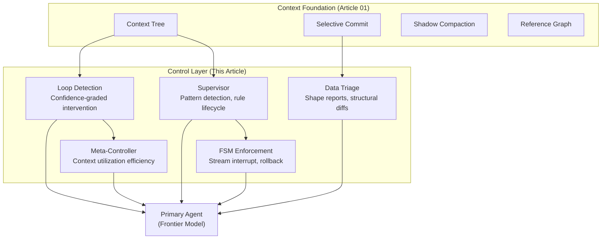

# Closing the Control Loop: Supervisor, Triage, and Enforcement

You've seen it happen again and again. You're deep in a debugging session with an agent — 30 turns in, the context is rich, the agent has accumulated real understanding of the codebase. Then it starts going off track. It reads the wrong file. It proposes a solution you've already rejected. It writes a 200-line script when a one-liner would do. You watch it happen, unable to intervene until the generation finishes, and by then the damage is done: precious context filled with irrelevant output, accumulated understanding diluted.

This is the open-loop problem. Every agent interface on the market — whether it's a code editor, a CLI tool, or a chat window — works the same way: you send a prompt, the agent generates a response, you read it, you send the next prompt. The human is the only observer, the only pattern detector, the only one who can intervene. Every rule the agent follows lives in a static config file (`.cursorrules`, `CLAUDE.md`) that the user wrote and the agent treats as suggestions. The user catches the same mistake for the fifth time in a session and manually adds a reminder to the config. The agent says "got it" and repeats the mistake two turns later.

The [previous article](./01-why-agents-waste-context.md) addressed context management — keeping the window lean and high-signal. But even with perfect context, the agent itself needs supervision. Not static rules in a config file. Active, content-aware supervision that learns from patterns, filters data before it enters context, detects when the agent is going in circles, and enforces constraints at runtime — not after the fact.

This isn't a hypothetical. Every developer who has spent more than a few hours with an agentic tool has a catalog of these moments: the agent that keeps forgetting to run tests after editing code, the agent that writes shell scripts when it should use proper tools, the agent that re-investigates the same error three times because it doesn't remember what it already tried. These are the patterns a closed-loop system would catch.

The structural diagram above shows *who talks to whom*. What makes it a closed loop is the **process** — a repeatable cycle where every action is measured against a target function, deviations are corrected, and the result feeds back into the next iteration:

Step ③ is the key difference from the current open-loop state. The **target function — minimize context waste per insight produced** — is what turns a passive observer into a control system. Without it, the supervisor has no criterion for deciding whether an action is "good" or "bad," and no way to measure whether an intervention helped.

## Why This Matters for Regular Users Even More Than for Enterprises

Enterprise agent deployments have teams, budgets, and the luxury of building custom guardrails. If an enterprise agent goes off track, someone reviews the logs, adjusts the config, and the next run is better. The feedback loop exists — it's just slow and expensive.

For an individual developer — the solo engineer working late with Claude Code, the open-source contributor trying to fix a bug in an unfamiliar codebase, the student building their first project with an agent — there is no feedback loop. There's no team to review what went wrong. There's no config-tuning iteration cycle. There's just you, watching the agent burn through your context window with repetitive mistakes, unable to intervene until it's too late. Each wasted turn costs tokens. Each loop through the same failed approach degrades the accumulated understanding that made the session valuable. When you finally give up and restart, everything the agent learned is gone — because current tools don't persist session knowledge.

The infrastructure described below — supervisor, triage, loop detection, meta-controller, enforcement — is the closed-loop system that makes agents reliable without requiring a human to watch every turn. For enterprises, it's a quality improvement. For individual users, it's the difference between a tool that helps and a tool that wastes your time and money.

## The Supervisor: From Passive Rules to Active Learning

Some tools have a supervisor structure already, but it's purely process-aware: "did you run tests?", "did you update docs?" — essentially `setInterval(promptReminder, threshold)` with a few red-flag heuristics. The agent usually responds "yes, I'll check" and continues as before.

A real supervisor needs to be content-aware:

| Capability | Generic Manager | Content-Aware Supervisor |
|---|---|---|
| Awareness | Process checkpoints | Code structure, incident history, entity relationships |
| Intervention | Static prompts | Specific, grounded in accumulated patterns |
| Learning | None | Outcome-tracked, rules evolve over time |
| Scope | Same for all projects | Project-specific persistent knowledge |
| Signal/noise | High noise, low signal | Silent when nothing to say, precise when triggered |

### Pattern Detection and Rule Lifecycle

The supervisor detects patterns by clustering similar action sequences through embeddings of tool-call traces plus error/correction outcomes. After 2-3 matches, a cluster becomes a rule candidate. The critical subtlety: distinguishing "genuinely the same root cause" from "superficially similar incidents" — embedding similarity alone is insufficient; you need matching on the type of correction action.

Rules need **triggers**: not "sometimes X breaks" but "if file X is edited and tests not run within N turns, signal Y." Without a trigger, a rule is noise with nothing to hang retrieval on.

And rules need lifecycle management:

| Stage | Entry Criteria | Exit Criteria |
|---|---|---|
| **Candidate** | 2-3 similar incidents clustered | Promoted or discarded within 14 days |
| **Active** | Verified effective at least once | Decays if not triggered in 30 days |
| **Decaying** | Not triggered recently | Tombstoned after 14 more days |
| **Tombstoned** | No longer applied | Retained as negative example |

A stale rule is worse than no rule — it creates false confidence. Rules need verification stats ("applied N times, prevented incident M times") and expiry/decay. Without this, the rule base becomes a landfill of artifacts from long-gone bugs within months.

### The Retrieval Substrate

The supervisor requires a hybrid retrieval substrate — not just embeddings, but:

- **Knowledge graph** with typed relationships: entities, derivation chains, ownership, causal edges
- **Structural/symbol index** for code: definitions, references, callgraph, type usage
- **Temporal/event log** with causal ordering: what followed what, which interventions led to which outcomes
- **Embedding indexes** at different granularities for semantic recall
- **Inverted index / BM25** for exact matches on error messages and identifiers — embeddings systematically fail here

The hard part isn't any single index — it's keeping them in sync and routing queries to the right one.

### The Cold Start Problem

Every component described above assumes accumulated data: patterns from past sessions, frequency signals for re-ranking, clusters of similar incidents. But every session starts at zero. The first 5-10 turns have no frequency signal, no cluster history, no learned rules. The supervisor can't detect patterns it hasn't seen yet.

The solution is straightforward but needs to be stated explicitly because it affects behavior: **during cold start, hold everything at full fidelity and index without compressing.** The shadow pipeline from [article 01](./01-why-agents-waste-context.md) doesn't attempt aggressive compaction until context exceeds ~50% of threshold. The supervisor doesn't attempt rule promotion until it has at least 2-3 clustered incidents. The meta-controller doesn't evaluate context utilization efficiency until there's enough history to compare against.

This is the same pattern as a cache warming up — L1 holds everything until there's enough traffic to know what deserves L2. Cold start isn't a failure mode; it's a scheduled phase. The system just indexes, observes, and waits for signal.

### External Authority Cross-Check

The supervisor's retrieval substrate indexes what the agent has already seen — internal project knowledge, accumulated patterns, session history. But when the agent makes a critical factual claim ("this API returns a 404 on missing resources," "this library supports connection pooling," "the default timeout is 30 seconds"), internal knowledge isn't enough. The agent might be wrong, and confidently so.

This is architecturally distinct from the supervisor's pattern detection. Pattern detection catches behavioral mistakes — the agent forgetting to run tests, looping on the same approach. An external authority cross-check catches **factual errors**: claims about APIs, specifications, or documented behavior that the supervisor has no internal basis to validate.

The mechanism: when the agent makes a factual assertion that would affect a critical decision, the cross-check queries authoritative external sources — official documentation, RFCs, reference implementations, ground-truth API specs. A cheap model compares the agent's claim against the source and flags discrepancies. This isn't verifying every sentence — it's spot-checking the claims that matter: API behaviors, configuration defaults, version-specific constraints, security-relevant assertions.

The reason this needs to be a separate component rather than just "better prompting": the agent can't evaluate its own factual accuracy. It either knows the correct answer (in which case it wouldn't make the error) or it doesn't (in which case it can't catch itself). The cross-check is an independent verification layer with access to different information than the primary agent.

## Data Triage: The Missing Layer Between Tools and LLMs

LLMs are fundamentally mismatched for processing large semi-structured data. When they try, you get either crude summarization that loses signal, or brittle one-off scripts that break when data formats shift.

A data triage sub-agent sits between the primary agent and any tool producing large output. It's mostly algorithmic:

**Format detector** recognizes standard formats (syslog, JSON lines, hex dumps, disassembly), extracts implicit schema.

**Shape report** produces a summary a human would give scanning unfamiliar data: "10MB logs, 200K lines, 8% warnings, error cluster in window 14:32-14:47, dominant module — auth, unique stack traces — 4." Tens of lines, fits in context.

**Diff layer** — the most valuable piece. When there's a prior run of the same tool, structural diff: "3 new warning types appeared, one error type disappeared, latency cluster shifted +30ms." In most debugging sessions, this is the signal that matters — not what's there, but what changed.

**Query API** lets the LLM ask targeted questions after the shape report: "errors from auth module in window 14:32-14:47," "top 10 unique stack traces by frequency." Triage responds with structured answers of a few KB, not megabytes.

The triage layer integrates naturally with selective commit: raw output never enters long-term context. Only the shape report stays visible. When an investigation closes clean, the handle gets discarded.

## Loop Detection: When the Agent Goes in Circles

The FSM enforcement section below handles violations of known rules — patterns the supervisor has learned and encoded. But there's a distinct failure mode that doesn't match any rule: the agent going in circles. Re-running the same searches, asking the same questions, revisiting an approach that already failed three turns ago. This isn't a "violation" — it's a cycle. And it's one of the most common ways an agent session degrades.

Anyone who has used an agentic tool for more than 30 minutes has seen this: the agent tries approach A, fails, tries B, fails, circles back to A with slightly different wording, fails again. Each cycle adds thousands of tokens of near-identical tool output and reasoning to the context. By the time the user notices and manually intervenes, the accumulated bloat has already pushed the session toward compaction — or worse, the agent's quality has degraded enough that it can't recognize it's looping.

The detection signals are cheap:

- **Embedding similarity** between the current query and the accumulated query history — high similarity on recent queries is the primary signal
- **N-gram matching on tool call patterns** — the same sequence of tool calls (read file → search → read file → search) with similar arguments
- **Solution similarity** — proposed solutions that match already-rejected ones, weighted by how recently they were rejected

The hard part isn't detection. It's the **intervention policy**.

Being too aggressive breaks legitimate exploration. An agent retrying a search after fixing the underlying cause isn't looping — it's verifying. An agent trying a similar approach with a key parameter changed isn't repeating — it's refining. False positives here are particularly damaging because they break the agent's ability to do thorough investigation.

Being too lenient wastes compute and context. Each cycle through the same approach adds thousands of tokens without progress. The user watches the agent spin, unable to intervene until the cycle becomes obvious — by which time the damage to context quality is already done.

The reasonable compromise is **confidence-graded intervention**:

| Confidence | Signal | Response |
|---|---|---|
| **Low** | One signal matches (e.g., similar query embedding) | Nudge: surface the prior attempt in context, let the agent decide |
| **Medium** | Two signals match (e.g., similar query + similar tool calls) | Soft redirect: inject the prior section explicitly, suggest alternatives |
| **High** | All signals match, near-identical to rejected approach | Hard interrupt: stop generation, inject cached section, require explicit justification to continue |

This is where the [context tree from article 01](./01-why-agents-waste-context.md) becomes essential. Without it, loop detection can only compare against the last N turns in the current window. With it, the detector can traverse the full history — across branches, across compaction boundaries, across the agent's entire exploration of the problem. A query that looks novel in the last 5 turns might be the third attempt at the same approach when viewed against the full tree.

The detector itself can run on a cheap local model — it's a pattern-matching task over behavioral traces, not a reasoning task. This is the same compute hierarchy that appears throughout the architecture: cheap models for observation and meta-control, frontier models for actual reasoning.

### The Meta-Controller: Reasoning About Context Utilization

The supervisor watches for pattern violations. Loop detection catches cyclical behavior. Both are reactive — they respond to things that already went wrong. There's a layer above both that's proactive: a reasoning pass that doesn't look at the user's task at all, but at **how the primary agent is using context.**

The meta-controller asks different questions than the supervisor:

| Layer | What it watches | What it asks |
|---|---|---|
| **Supervisor** | Agent actions vs. accumulated rules | "Did this violate a known pattern?" |
| **Loop Detection** | Agent behavior over time | "Is this the same thing again?" |
| **Meta-Controller** | Context utilization efficiency | "Did this turn add value? What parts of context are actually being used? What next step maximizes the utility of what we've accumulated?" |

This is metacognition applied to context management. The primary agent reasons about the user's problem. The meta-controller reasons about the primary agent's reasoning — specifically about whether the context state is being used efficiently, whether exploration is productive, and what path forward would extract the most value from accumulated knowledge.

The key advantage: this controller runs on a cheap local model. It's not solving the user's task — it's pattern-matching over behavioral traces (tool call density, context utilization rates, exploration patterns). A 7-13B local model is sufficient for this kind of structured analysis. The compute hierarchy becomes explicit: cheap models handle context maintenance and meta-control at the edges, the frontier model handles actual reasoning in the center.

The risk is real. A meta-controller reasoning about its own context utilization can start hallucinating positive assessments — "I'm using context efficiently" — when the objective evidence says otherwise. Without safeguards, self-reflection degrades into self-justification. This is a known failure mode in reflection-based architectures.

The safeguard is objective ground-truth metrics that the meta-controller cannot self-report:

- **Goal attainment rate**: did the primary agent actually reach its stated objective?
- **Tool calls per unit of progress**: is the agent making progress proportional to its activity?
- **Loop prediction accuracy**: what fraction of loops did the meta-controller flag before the user noticed?
- **Context utilization after intervention**: did meta-controller suggestions actually improve context efficiency?

Without these signals, the meta-controller has no feedback loop to calibrate against. With them, it can be validated and improved the same way any other component is — through measurable outcomes.

## Runtime Enforcement: FSM with Stream Interruption

Without enforcement, the entire architecture is advisory. The supervisor warns, the triage filters — and the LLM silently ignores everyone and writes a bash one-liner.

Pattern detection in streaming output is cheap — surface markers like "I'll write a script" are detectable through token-level pattern matching without a second LLM. Stream interrupt APIs exist in most providers. Rollback through the substrate's tree of contexts restores pre-generation state.

| Rule Level | Trigger | Response |
|---|---|---|
| **Hard** | Certain operations always require hub query | Immediate interrupt |
| **Project** | Supervisor accumulated project knowledge | Project-specific transitions |
| **Soft** | Confidence-graded preference | Warning, agent can justify |

Rules evolve: initially manual config, supervisor observes violations and proposes new rules, effective rules promote from soft to hard, stale rules decay. Same lifecycle as psychologist markers and hub stats — unified aging semantics across the entire system.

### Should the Agent Know the Rules Exist?

There's a design choice in FSM enforcement that's easy to overlook: should the LLM know the rules are being enforced?

**Hidden enforcement** — the LLM doesn't know it's being watched. It encounters mysterious stream interruptions and corrective prompts without understanding why. This catches an important case: models that "know the rule" from training but default to old patterns anyway. The hidden FSM catches these lapses because the model isn't gaming the system — it's just failing to follow through.

**Transparent enforcement** — the system prompt explicitly describes the rules, and the FSM serves as backup. The agent has a chance to self-correct before enforcement triggers.

The hybrid approach is the right answer. The system prompt tells the agent the rules exist and what they are. The FSM enforces them as a safety net when self-correction fails. This works better than pure hidden enforcement for a subtle reason: a smart model that discovers hidden rules (and it will — the patterns are observable over many sessions) can learn to paraphrase around pattern matching without understanding that it should actually follow the rule. Transparency removes this adversarial dynamic. The agent knows the constraint, tries to comply, and the FSM catches the cases where compliance fails — which is the normal failure mode, not adversarial evasion.

## Expected Outcomes: What the Control Layer Adds

This article covers five systems — supervisor, triage, loop detection, meta-controller, FSM — that sit on top of the context management foundation from [article 01](./01-why-agents-waste-context.md). The baseline for this table is what you already have after implementing selective commit + shadow compaction: ~5K tokens at turn 50, near-zero compaction pause, ~$1-4/session. Here's what each additional layer contributes:

- **+ Supervisor** — A content-aware supervisor that learns from patterns, manages rule lifecycle (candidate → active → decaying → tombstoned), and maintains a hybrid retrieval substrate (knowledge graph, structural index, temporal log, embeddings, BM25).
- **+ Data Triage** — A sub-agent between tools and the LLM that produces shape reports, structural diffs, and a query API. Megabytes of tool output become a few KB of structured answers. Raw data never enters long-term context.
- **+ Loop Detection** — Confidence-graded detection of cyclical agent behavior (similar queries, repeated tool patterns, re-proposed rejected solutions). Low-confidence nudges surface prior attempts; high-confidence matches trigger hard interrupts with cached context injected. Requires the context tree for full-history comparison.
- **+ Meta-Controller** — A proactive layer above supervisor and loop detection, reasoning about context utilization efficiency rather than task completion. Runs on a cheap local model, validated against objective ground-truth metrics.
- **+ FSM Enforcement** — Runtime pattern detection on streaming output with soft nudge / hard interrupt / rollback. Hybrid transparency: system prompt describes rules, FSM enforces as backup. Rules start manual, evolve through supervisor observation, and promote from soft to hard over time.

| Metric | Baseline (after article 01) | + Supervisor | + Triage | + Loop Detection | + FSM Enforcement | All combined |
|---|---|---|---|---|---|---|
| **Effective context for reasoning** | ~5K tokens of distilled insights | ~4K (supervisor prunes stale rules) | ~3K (raw tool output filtered) | ~3K (loop traces pruned) | ~3K (no wasted tokens on violations) | ~2-3K tokens |
| **Repeated mistakes per session** | Agent repeats known pitfalls | Near-zero (learned rules fire) | Reduced (better signal) | Near-zero (cycles detected early) | Reduced (hard rules block) | Near-zero |
| **Time to detect agent going off-rails** | User notices manually | Minutes (pattern-based alerts) | Faster (cleaner signal) | Seconds (loop signals are immediate) | Seconds (stream-level detection) | Seconds |
| **Context wasted on cycles** | Significant (loops accumulate) | Reduced (some rules catch patterns) | Reduced (cleaner data) | Near-zero (cycles caught and pruned) | Reduced (some loops violate rules) | Near-zero |
| **Rules / knowledge persistence** | None (CLAUDE.md is manual) | Rules learned, tracked, decayed | Unchanged | Loop history feeds supervisor | Enforcement history persists | Full lifecycle across sessions |
| **Engineering effort (incremental)** | — | 2-3 weeks | 1-2 weeks | 1 week (cheap model + signals) | 1 week | 5-6 weeks total |
| **Models required (incremental)** | — | Same (local verifier) | Algorithmic (no LLM) | Cheap local model for detection | Same (pattern matching, no LLM) | 1 additional cloud hosted or local model for supervisor |

**The single highest-leverage addition** is data triage — it's mostly algorithmic (no extra LLM needed), it integrates directly with selective commit, and it reduces what enters context from megabytes to kilobytes per tool call. One to two weeks of engineering for an order-of-magnitude reduction in context pollution from tool output.

**All five combined** create the closed loop: the supervisor learns, triage filters, loop detection catches cycles, the meta-controller optimizes context utilization proactively, and enforcement guarantees compliance. Each layer makes the others more effective — the supervisor needs clean data from triage, loop detection needs the context tree for full-history comparison, the meta-controller needs objective metrics from all other layers, and enforcement needs rules from the supervisor. The compound effect is that the agent stops being a tool that works when watched and becomes a system that works correctly when left alone.

### The Cost of Not Having This

The table above shows what each layer adds. Here's what the absence of all of them costs — per session, per developer, per month.

**Token waste from unsupervised sessions.** A typical 50-turn agent session without supervision includes 3-5 loops (the agent re-investigating the same problem), 2-3 instances of the agent repeating a known mistake (forgetting to run tests after edits, writing scripts instead of using tools), and at least one major context pollution event (a 20K+ token tool output dump that enters context unfiltered). Total wasted tokens per session: 40-80K out of ~200K. On a Claude Code Max subscription ($100/mo), you're watching your monthly budget burn on zero-value output — and hitting the rate limit sooner, which means waiting when you need the tool most.

**Session restarts from context degradation.** Without loop detection or enforcement, context quality degrades past the point of usefulness around turn 30-40. The agent starts producing lower-quality output because its context is polluted with repetitive traces and unfiltered tool dumps. The user has two choices: continue with degraded quality (and accept bad results), or restart the session. Restarting means losing everything the agent learned. A developer working on a complex task might restart 2-3 times in a day. Each restart is not just lost tokens — it's lost accumulated understanding that took 30+ turns to build.

**Human time spent babysitting.** Without automated supervision, the human is the supervisor. Watching for loops, catching repeated mistakes, manually intervening when the agent goes off track. In a typical session, this adds 10-20 minutes of active monitoring time on top of the time spent actually working with the agent. For a developer using an agent for 4 hours a day, that's 40-80 minutes of pure waste — time spent watching a tool instead of using it.

**The monthly tally for a single developer** (assuming Claude Code Max at $100/mo):

| Cost Category | What It Looks Like | Monthly Impact | Monthly Cost |
|---|---|---|---|
| Wasted subscription usage | 40-80K tokens/session burned on loops, repeated mistakes, unfiltered dumps | 15-20 degraded sessions | ~33-50% of subscription |
| Rate limit lockout | Loops and wasted tokens deplete your usage cap. You hit the limit and wait — sometimes minutes, sometimes hours — unable to continue working. The agent is locked out, you're blocked, the task context is degrading while you wait | 5-10 lockout events/month | 2-8 hours/month of dead time |
| Session restarts | 2-3 restarts/day on complex tasks. Each loses 30+ turns of accumulated understanding — codebase knowledge, error patterns, valid approaches, all gone | 5-13 hours/month of rework | — |
| Human babysitting | Watching the agent spin, manually catching loops, adding rules to config files the agent ignores. Not working *with* the agent — monitoring it | 10-27 hours/month of monitoring | — |
| **Total** | | **17-48 hours/month + 33-50% of subscription wasted** | |

Seventeen to forty-eight hours per month — that's half a work week to more than a full week — spent not building, not debugging, not shipping. Just watching an agent repeat mistakes, restarting sessions, and waiting for rate limits to reset. Plus a third to a half of your subscription burned on output that produced zero value.

Put differently: if you're spending 17-48 hours/month on babysitting, rework, and waiting for rate limits to reset, and a typical developer works ~160 hours/month, you're losing 10-30% of your total productive capacity to problems that the closed-loop system would prevent. A developer who currently gets 4 productive hours out of an 8-hour day with an agent would get 7-8. That's potentially doubling the effective output from agent-assisted development — not by working harder, but by eliminating the waste that's already baked into the workflow.

For a team of 10 developers, that's 150-400 hours/month — and the subscription waste scales the same way.

The closed-loop system described in this article — all five layers — would take 5-6 weeks to build. At these numbers, it pays for itself within the first month. The question isn't whether this infrastructure is worth building. It's how many developer-hours are being thrown away every month while it doesn't exist.

### What $100/Month Should Buy

A good SME or senior advisor doesn't just answer your question and wait for the next one. They anticipate problems, explore alternatives you haven't considered, run the comparison themselves, and present you with options: "Approach A is faster but fragile here. Approach B handles the edge case but adds a dependency. I'd recommend B because of X. Want me to proceed?" That's what expertise looks like.

Here's the uncomfortable truth behind the numbers. A developer paying $100/month for a coding agent subscription shouldn't be getting a tool that demands constant babysitting. For that money — and to justify the hype around agentic development — the system should act like a skilled subject-matter expert. Not someday. Now. And arguably for less, because in practice users are paying with their money, skills, and time to alpha-test systems that aren't ready yet.

Current agents don't do all those advertised and expected things. They wait for your prompt, execute it literally, and go in circles when the literal interpretation doesn't work. The five layers described above — supervisor, triage, loop detection, meta-controller, enforcement — are the minimum to stop the bleeding. But the architecture they enable goes further: with loop detection preventing wasted cycles and the meta-controller reasoning about context utilization, the system has the bandwidth and awareness to explore alternatives proactively, test them against each other, and present a comparison instead of a single best-effort answer.

That's the gap. Not "make the agent slightly less annoying." The gap is between a tool you watch and correct, and an advisor that explores, compares, and recommends. The closed-loop system is what makes the second version possible — and at current subscription prices, it's what users should already be getting.

But the closed loop only works if the agent can reach the right tools at the right time — without dumping every tool definition into every context window. That's the next layer.

---

*Part of [Building the Agentic Operating System](./00-index.md) · Previous: [Why AI Agents Waste Context](./01-why-agents-waste-context.md) · Next: [The MCP Hub](./03-the-mcp-hub.md)*
