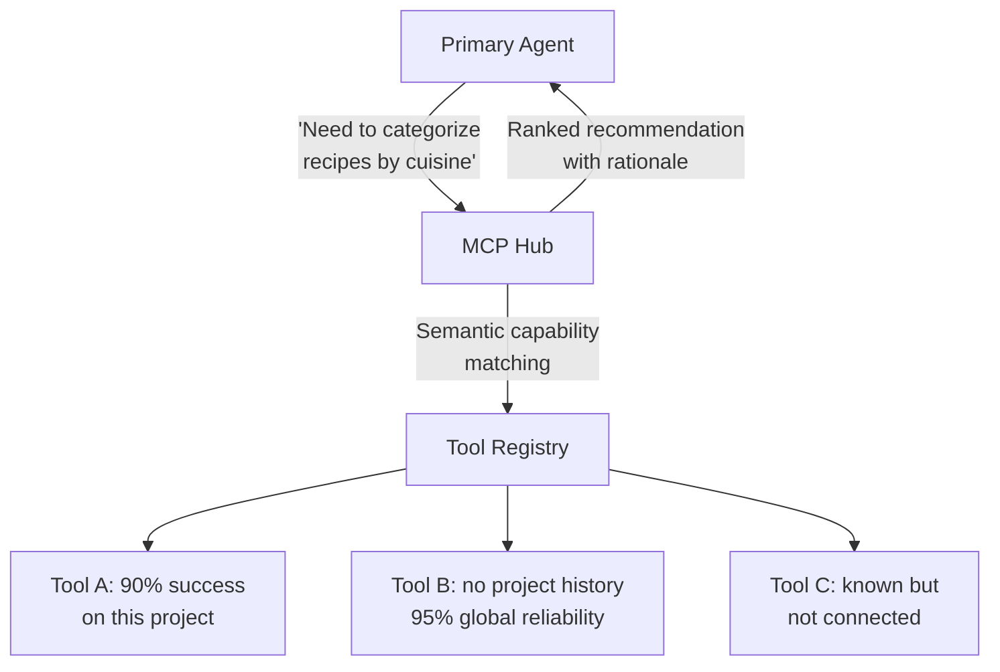

# The MCP Hub: Orchestration Infrastructure for Agents

Here's who gets hurt most by the current state of agent tooling: **the IT professional, the DevOps engineer, the data analyst, the security auditor — anyone whose daily work touches a dozen different systems.** They need agents that can work across GitHub, Jira, AWS, Datadog, Salesforce, and their own internal tools. Not a curated subset. Not three integrations max. The full stack they actually use.

Large AI providers don't have this problem. Perplexity curates a fixed set of search endpoints. Anthropic and OpenAI optimize for their own platforms. Their incentive is narrower integration, not broader — and they're economically rational to do so. But for everyone outside the hyperscaler bubble, the agent ecosystem looks like non-standardized chaos: every tool has its own API, its own auth, its own schema, its own failure modes, and no two tools compose the same way twice.

MCP was supposed to fix this — a standard protocol for connecting any tool to any agent. And at the wiring level, it works. But at the orchestration level, it's missing entirely. The protocol connects things. Nobody is **managing** the connections.

The symptoms are everywhere:

- **Context bloat.** Every connected MCP server dumps its full tool catalog into the context window. A database client exposes 50 tools, a cloud SDK another 60 — that's the entire tool budget gone on two integrations. Antigravity enforces a 100-tool hard limit. Anything exposing 200+ tools is simply unusable.
- **Silent failures.** A tool returns garbage or times out, and the agent has no fallback, no retry, no idea what went wrong. It just stops or hallucinates a result.
- **No composability.** Tool A works fine alone. Tool B works fine alone. Together they break — conflicting schemas, overlapping names, incompatible auth. Nobody tracks which tools compose and which conflict.
- **No reliability memory.** The agent makes 500 calls to Tool A over a month, and never learns that it fails 15% of the time on Tuesdays during peak load. Every session starts from zero.

What's needed is not a smarter proxy or a bigger context window. It's a **control plane** — a layer that provides routing, health checking, failover, and lifecycle management for the agent tool ecosystem. The tools and sub-agents can run anywhere: local MCP servers, cloud APIs, spawned processes, remote A2A endpoints. The control plane doesn't care where. Location is configuration, not architecture.

## What a Hub Is Intended to Do

Nobody has built the full thing yet. Partial solutions exist (covered below), but the complete orchestration layer this article describes is still a proposal — an architecture waiting to be implemented. Here's what it's designed to do:

The hub would operate at the **capability level**, not tool-name level. The agent describes what it needs semantically — "need to categorize recipes by cuisine" — and the hub searches a catalog, ranks options by relevance and reliability, and returns a recommendation with rationale. It knows about tools that aren't connected but known to exist. It can compose workflows from multiple tools. And it ranks by reliability using project history and global stats.

But discovery is just the entrypoint. The intended value is **reliable orchestration**:

- **Route** the task to the best tool (capability matching + reliability ranking)
- **Monitor** the response (did it succeed? was it slow? did it return garbage?)
- **Retry** with a fallback if the primary fails (replica set semantics)
- **Record** the outcome in the registry (reliability stats update automatically)
- **Report** failures to the supervisor (which may promote a soft rule to hard)

Discovery gets you the right tool. Orchestration makes sure the job actually gets done.

This is service discovery — the same problem Consul, etcd, and DNS solve for microservices, applied to the agent tool layer. The question is: how much of this already exists, and how much needs to be built?

## What's Already Shipping

The ecosystem has started solving pieces of this. No single solution covers everything described above, but several address specific parts:

| Solution | Approach | Token savings | Scale fit | Desktop-friendly? |
|---|---|---|---|---|
| **MCPProxy** | BM25 search gateway; indexes all tools, returns top-k per query | 54K → ~1K (98%) | Solo to team | Yes — single binary, in-memory index, zero deps |
| **Solo AgentGateway** | Progressive disclosure via `get_tool` / `invoke_tool` meta-tools; on-demand schema loading | Full catalog → 2 meta-tools | Enterprise (K8s) | No — requires Kubernetes |
| **Anthropic native** | Anthropic's own MCP optimization (2026) — reduced tool schema injection | Significant (undisclosed) | Claude API users | N/A — provider-side |
| **Perplexity Agent API** | Abandoned MCP entirely; fixed curated endpoints, no dynamic discovery | 100% (no tool schemas) | Their own product only | No — proprietary, single-agent |
| **MCP Registry** (official) | Community catalog of MCP servers; discovery of *servers*, not tools within servers | Indirect (find right server faster) | Ecosystem-wide | Yes — just a directory |
| **Argentor Orchestrator** | TF-IDF + keyword hybrid search for tools across servers | Significant (on-demand) | Solo to team | Yes — Rust crate, local |
| **Manual curation** | Connect fewer servers, curate tool lists in config | Varies | Any | Yes — the "just use fewer tools" approach |

The key observation: **MCPProxy is the closest thing to what this article describes** — a single binary that sits between the agent and all MCP servers, builds an in-memory BM25 index, and returns only the 3-5 relevant tools per query. Sub-millisecond latency, zero dependencies, 87%+ top-5 accuracy for catalogs up to several hundred tools. For a solo developer, this is install-and-run. But MCPProxy provides only the keyword-matching signal of what a full multi-strategy discovery engine needs. It solves the "narrow the catalog" problem well — it doesn't solve the rest:

- **Which tool for this task?** The user asks something vague ("fix the deployment issue"). Keyword matching catches obvious names, but doesn't know that Tool A has 92% success on deployment-related tasks while Tool B has 67%. Semantic embeddings catch the *meaning*, but miss reliability. Behavioral signals catch what the LLM actually gravitates toward. Each signal alone is insufficient — the gap is that no current solution combines them.
- **Which agent for this request?** A request might need a tool ("read this file"), a sub-agent ("triage these logs"), or a specialist model ("summarize this output"). Nobody is routing between these categories. The LLM picks by name familiarity, not by fitness for the task.
- **Performance and reliability data.** Ten tools can all do "text search." Which is fastest? Which returns the most useful results for codebases vs. log files? Which has been unreliable this week? None of this is tracked. Every session starts blind.
- **Complexity trap.** The irony: the solutions that are supposed to offload the human user instead demand setup, configuration, tracking, and maintenance. The IT professional who just wants their agent to work across GitHub and Jira now has to curate catalogs, tune search parameters, and monitor reliability stats. The cure is starting to look like the disease.

The hub architecture below is designed to solve all four gaps — but the key design constraint is that it must **reduce complexity for the user, not add to it.** Reliability data accumulates automatically from tool-call outcomes. Performance baselines build passively. Routing decisions use accumulated data, not manual configuration. The system should get smarter with every session without the user doing anything.

## The Missing Standard: A2A for the Desktop

Google's A2A (Agent-to-Agent) protocol, now an open standard under the Linux Foundation, solves exactly the agent coordination problem. It defines how agents discover each other's capabilities (via Agent Cards), negotiate tasks, stream results, and handle long-running work — all over HTTP + JSON-RPC.

But A2A is designed for enterprise infrastructure. It assumes persistent endpoints, OAuth 2.0 authentication, server-side agents, and Kubernetes-scale deployments. A solo developer running a coding agent, a triage sub-agent, and a summarization specialist on a laptop doesn't need any of that.

What's missing is a **lightweight desktop agent bus** — call it A2A-lite — that provides:

| Capability | A2A (enterprise) | A2A-lite (desktop) |
|---|---|---|
| **Transport** | HTTP + JSON-RPC over network | Unix domain sockets or stdio pipes |
| **Discovery** | Agent Cards at well-known URLs | Agent Cards in `~/.agents/` directory |
| **Auth** | OAuth 2.0 + mTLS | Process ownership (same user) |
| **Task lifecycle** | Full state machine with push notifications | Simple request/response + streaming |
| **Persistence** | External task store | In-process or SQLite |
| **Protocol overhead** | ~200 lines of JSON-RPC per interaction | ~20 lines of JSON over stdio |

The idea: any local agent process (or sub-agent) publishes an Agent Card describing its capabilities. The primary agent discovers them the same way A2A does — by reading cards — but over local files or IPC instead of HTTP. Task delegation, streaming results, and cancellation use the same semantics as A2A, just without the network layer.

This would give desktop developers the same architectural benefit — agents that can delegate to specialists, discover capabilities dynamically, and coordinate on tasks — without the enterprise infrastructure tax. And it would be compatible with A2A at the semantic level: a desktop agent bus that can graduate to full A2A when deployed to a server.

Nobody has built this yet. The MCP ecosystem is still solving the simpler problem (tool discovery) and hasn't reached agent-to-agent coordination on the desktop. But the need is clear: as agents get more specialized — a triage agent, a summarization agent, a verification agent — they need to talk to each other. Stdio pipes and ad-hoc JSON aren't going to scale.

## Why LLMs Won't Query on Their Own

LLMs default to writing code rather than querying for existing tools. This isn't a personality flaw — it's training distribution. The model has seen millions of examples of "write a script to X" and far fewer examples of "search tool catalog, find existing capability, use it." The prior is overwhelmingly biased toward code generation.

Solving this requires three things:

**Tiered tool access.** The agent doesn't see all tools at once. It sees a small set of commonly-used tools plus the hub. Everything else is discovered on demand. This reduces context tax and creates a natural "query first" flow.

**Concrete triggers for hub queries.** The FSM enforcement layer from [the previous article](./02-closing-the-control-loop.md) can catch "I'll write a script" patterns and redirect to a hub query. Surface markers like "I'll write a script to" are detectable through token-level pattern matching — no second LLM needed.

**Asymmetric cost framing.** The hub query costs ~100 tokens. A wrong script costs ~2K tokens to generate, ~5K tokens of failed output, and ~500 tokens of error analysis. When the cost differential is visible to the agent, the rational choice becomes obvious.

## The Tool Registry

The hub needs a registry that tracks more than tool names:

| Registry Field | Purpose |
|---|---|
| **Capability embeddings** | Semantic matching between agent need and tool function |
| **Project-specific reliability** | Success rate on *this* codebase, not globally |
| **Global reliability** | Aggregate success rate across all projects |
| **Known failure modes** | "Breaks on binary files >10MB", "Timeouts on concurrent access" |
| **Composability** | Which tools work well together, which conflict |
| **Connection status** | Connected, known-but-disconnected, unknown |

Reliability stats come from the supervisor (which tracks tool-call outcomes) and the psychologist (which tracks whether tool failures correlate with model health). This is another example of the layers reinforcing each other — the hub is only as good as its reliability data, and that data comes from the systems built in the previous articles.

## Context Savings

The immediate ROI of a hub is context window real estate. Today, connecting a handful of MCP servers means dumping their entire tool catalogs into the context window on every session. A database client exposes 50 tools. A cloud SDK another 60. A monitoring integration adds 30 more. Three servers and you're at 140 tool schemas — roughly 28K tokens — before the agent has read a single line of user input. Scale to a realistic professional setup with 5-10 MCP integrations and you're looking at 200-300 tools, 40-60K tokens of tool definitions consuming 20-30% of a 200K context window before the conversation even starts.

| Approach | Tool definitions in context | Context overhead at start | Growth over session |
|---|---|---|---|
| Current (all tools loaded) | All MCP schemas, always (20-60K tokens) | 20-60K tokens before first user message | None — already maxed out |
| Hub (on-demand loading) | Hub schema + active tools only | ~500 tokens (hub schema alone) | ~200 tokens per tool discovered, only when needed |
| Hub + smart compaction (article 01) | Compacted summaries of previously-used tools | ~500 tokens | Near-flat — compaction reclaims tool schemas no longer relevant |

The hub doesn't just save tokens — it **inverts the cost curve**. Instead of paying 40-60K tokens upfront for tools you'll never call this session, you start near zero and pay incrementally only for tools you actually use. And because the compaction layer from article 01 continuously reclaims tool schemas that aren't needed anymore, the growth stays flat even in long sessions. The agent gets access to 300+ tools but the context cost is the same as having 3.

This compounds over a session. Tool definitions are sent with every API call — the model sees them on every round, not just once. A realistic scenario: an agent working with 10 actively-used tools across 200 connected, over 50 and 100 conversation rounds:

| | 50 rounds | 100 rounds |
|---|---|---|
| **Baseline** (200 tools × 200 tokens × N rounds) | 2M tokens on tool defs | 4M tokens on tool defs |
| **Baseline cost at $3/M input tokens** | $6.00 | $12.00 |
| **Baseline cost at $15/M input tokens** (frontier) | $30.00 | $60.00 |
| **Hub** (~500 hub + ~2K active tools × N rounds) | 125K tokens | 250K tokens |
| **Hub cost at $3/M** | $0.38 | $0.75 |
| **Hub cost at $15/M** (frontier) | $1.88 | $3.75 |
| **Tokens saved** | **1.9M** (94%) | **3.75M** (94%) |
| **Cost saved at $3/M** | **$5.63/session** | **$11.25/session** |
| **Cost saved at $15/M** (frontier) | **$28.13/session** | **$56.25/session** |

And there's the uncomfortable answer to why hyperscalers aren't rushing to solve this. That $30-60 per session on tool-definition tax isn't waste from their perspective — it's revenue. Every token the model processes on a tool schema it'll never call is a token billed at frontier rates. The incentive to optimize this away is weak when the inefficiency is a profit center. The same dynamic played out with cloud providers and idle VMs — auto-scaling only arrived when customers demanded it loudly enough. Tool-definition optimization will follow the same path.

That's per session. A developer running 5-10 agent sessions per day saves $50-500/day on tool-definition tax alone — not by using fewer tools, but by not paying for the 190 tools that aren't relevant to the current task. The hub makes the cost of 200 connected tools identical to the cost of 10.

## Who Would Build This

Ideally, this wouldn't be built by enthusiasts or small startups at all. A tool orchestration standard — one that every agent and every MCP server conforms to — should come from the major AI platform providers. Anthropic defined MCP. Google defined A2A. Either of them (or a joint effort under the Linux Foundation) could define the control plane layer that sits on top and manages routing, reliability, and discovery. The incentive is there: every dollar wasted on tool-definition tax is a dollar their customers burn on inference that produces no value. Every session that crashes because a tool hung is a session that makes their platform look unreliable.

But the hyperscalers optimize for their own ecosystems first. Anthropic's native tool optimization works for Claude. Google's A2A works for Google Cloud. Neither is incentivized to build the agnostic control plane that works across all providers — the same dynamic that left service discovery to Consul and etcd rather than any single cloud vendor. Until one of them moves, the orchestration layer falls to whoever needs it most.

The full control plane — health checking, failover chains, quality gates, composability tracking — would be an enterprise play. A cloud AI platform with 200 developers, dozens of MCP integrations, and a team that owns the agent infrastructure would build the full registry with replica set semantics. That's where the ROI of per-tool health monitoring and automatic failover would pay for itself.

But the core insight — don't load everything into context, and don't trust that tools always work — applies at every scale. The question is what each tier would implement:

| Scale | What you need | What you skip |
|---|---|---|
| **Solo developer, desktop** | On-demand tool loading, static catalog (JSON file), basic timeout + retry | Health probes, quality gates, composability, failover chains |
| **Small team, shared project** | + Basic success/failure counts per tool, team-shared catalog, simple fallback (if A fails, try B), multi-strategy discovery with shared embedding index | Project-specific reliability, quality gates |
| **Platform team, org-wide** | Full control plane: health probes, quality gates, failover chains, composability tracking, per-project namespaces | — |

The solo developer on a laptop doesn't need a full Kubernetes-style control plane. They need two things: stop loading 20K tokens of tool definitions they won't use this turn, and retry on failure instead of crashing. That's a configuration change and a few lines of wrapper code — and it recovers ~10% of the context window while making the agent resilient to tool failures. The MCP protocol already supports this; most tooling just doesn't do it yet.

The hub architecture described above is where this scales to. But the starting point is the same one-line config change whether you're on a laptop or in a datacenter.

## The Pragmatic Starting Point

The hub doesn't need to be built all at once. A useful v1:

1. **Static catalog + keyword search** — a JSON file mapping tool capabilities to semantic descriptions, plus BM25 indexing for fast keyword matching. A lightweight local embedding model can run on commodity hardware — no reason to skip it in v1.
2. **On-demand loading** — load only the tool schemas the agent requests instead of everything at startup. This is a configuration change, not an architecture change.
3. **Basic reliability tracking** — count tool calls and success/failure per tool per project. Simple stats, no ML.

This v1 takes days to implement and immediately recovers the context tax. The behavioral signals, reliability weighting, and composability tracking come later — and they're incremental additions to the same registry, not architectural changes. The important thing is that the first step — on-demand loading — is the same whether you're a solo developer on a laptop or a platform team in a datacenter. The architecture just adds layers as the scale demands them.

## Expected Outcomes: What the Hub Adds

This article covers the MCP Hub as an orchestration layer on top of the context management and control systems from [articles 01](./01-why-agents-waste-context.md) and [02](./02-closing-the-control-loop.md). The baseline is what you already have after implementing selective commit + shadow compaction + supervisor + triage + FSM enforcement: ~2-3K effective context tokens, near-zero compaction pause, near-zero repeated mistakes, seconds-level off-rails detection.

The hub's primary value is eliminating the largest remaining context tax: tool definitions. Here's what each stage adds:

- **+ On-demand loading** — Stop dumping all tool schemas into context. The agent starts a session with ~500 tokens (the hub schema) instead of 20-60K tokens (every tool from every connected MCP server). Tools are loaded only when the agent actually needs them. A configuration change, not an architecture change.
- **+ Multi-strategy semantic discovery** — Not just keyword matching (BM25) or just embeddings. A hybrid search engine that combines multiple strategies: keyword/BM25 for exact matches on tool names and parameter identifiers, semantic embeddings for "I need to categorize recipes" → cooking tools, behavioral signals (which tools the LLM actually picks and succeeds with), and reliability weighting (Tool A works 92% of the time for this type of task). Think Vertex AI Search scaled down to a local tool — the same multi-signal ranking, running on a laptop.
- **+ Reliability tracking** — Count tool calls and outcomes. Remember that Tool A fails 15% of the time on large files. Route around known-bad tools automatically.
- **+ Failover + health checks** — Liveness/readiness probes for tools and sub-agents. Automatic retry with fallback on failure. The agent never silently stops because a tool hung.

| Metric | Before hub (after articles 01-02) | + On-demand loading | + Multi-strategy discovery | + Reliability tracking | + Failover + health checks | All combined |
|---|---|---|---|---|---|---|
| **Tool defs at session start** | 20-60K tokens (all MCP schemas) | ~500 tokens (hub schema only) | Unchanged | Unchanged | Unchanged | **~500 tokens** |
| **Tool defs during session** | Same 20-60K, never changes | ~500 + active tools (~200 each) | Top 3-5 per query (~600-1K) | Unchanged | Unchanged | **Stays flat** (compaction reclaims unused) |
| **Context freed vs. baseline** | — | 19-59K tokens recovered | +1-2K more (better filtering) | Unchanged | Unchanged | **20-60K tokens freed** |
| **Discovery quality** | LLM picks by name familiarity | Unchanged | Multi-signal ranking (BM25 + semantic + behavioral + reliability) | Reliability weights refine ranking | Unchanged | Best-available tool selected automatically |
| **Tool failure handling** | Agent stops or hallucinates | Unchanged | Unchanged | Bad tools flagged, manually avoided | Auto-retry with fallback | Automatic recovery |
| **Cross-session tool memory** | None (every session starts fresh) | Unchanged | Unchanged | Reliability stats persist per tool | Health baselines persist | Full tool operational history |
| **New tool integration** | Manual config + context bloat | Manual config, no bloat | Auto-indexed on connection | Auto-tracked from first call | Auto-health-checked from first call | Plug in and it works |
| **Max usable tools** | Hard limit (~100-150, then context overflows) | Effectively unlimited (on-demand, not loaded) | Unchanged | Unchanged | Unchanged | **No practical limit** |
| **Wasted calls on bad tools** | Frequent (no reliability data, agent repeats failures) | Unchanged | Unchanged | Bad tools deprioritized, rarely called | Bad tools skipped entirely | **Near-zero wasted calls** |
| **Engineering effort** | — | Days (config change) | Days (install MCPProxy or similar) | 1-2 weeks | 1-2 weeks | 3-5 weeks total |

**The single highest-leverage step** is on-demand loading — days of work for recovering 20-60K tokens that were being wasted on tool definitions the agent never called. That's 10-30% of the context window, freed by a configuration change.

**All four combined** give the agent a reliable tool ecosystem instead of a fragile one. The agent starts near zero context overhead, discovers tools on demand, and compaction keeps the growth flat. The number of connectable tools is no longer constrained by context window size — 300 or 3,000 tools cost the same as 3. Tools fail gracefully, bad tools are routed around automatically, new tools integrate without context bloat, and composability knowledge accumulates over time. The hub is what turns a collection of MCP servers into a managed infrastructure — the same transition that Kubernetes made from "containers on a server" to "a platform you can trust."

## The Bigger Picture: Kubernetes for MCP

There's a useful analogy here. Kubernetes doesn't care whether your container runs on a bare-metal server in a basement or a managed node in GKE. It provides scheduling, health checking, failover, scaling, and lifecycle management. The workload declares what it needs; the control plane makes it happen.

Everything described in this article maps directly:

| Kubernetes | MCP Hub | What it means for agents |
|---|---|---|
| **Scheduler** | Capability router | Route tasks to the right tool or sub-agent based on semantic matching and reliability data |
| **kubelet** | Health checker | Is this tool responding? Is this sub-agent producing quality output? Liveness and readiness probes for everything |
| **Service discovery** | Capability catalog | Find tools by what they *do*, not what they're *called*. Semantic matching, not flat namespace |
| **Replica sets** | Fallback chain | Tool A fails? Try Tool B. Sub-agent hangs? Timeout and retry with a different one |
| **Liveness/readiness probes** | Quality gates | "This tool is up" vs "this tool is giving useful results" — different signals, both tracked |
| **etcd** | Tool registry | Persistent store of capabilities, reliability stats, failure modes, composability data |
| **Namespaces** | Project scopes | Different tool configurations, reliability baselines, and routing rules per project |
| **Control plane** | The Hub itself | The orchestration layer that ties everything together |

The parallel is exact. Kubernetes manages containers that run anywhere. The MCP Hub manages tools and sub-agents that run anywhere. Both provide the same set of guarantees: route to the right resource, monitor its health, retry on failure, and keep the operational data flowing back. The IT professional with a dozen systems to integrate doesn't need to think about any of this — they declare what they need, and the control plane makes it happen.

The hub is one piece of the infrastructure layer. But even with supervision, triage, enforcement, and tool discovery, the model itself can degrade silently. That's the next layer.

---

*Part of [Building the Agentic Operating System](./00-index.md) · Previous: [Closing the Control Loop](./02-closing-the-control-loop.md) · Next: [The LLM Psychologist](./04-the-llm-psychologist.md)*
