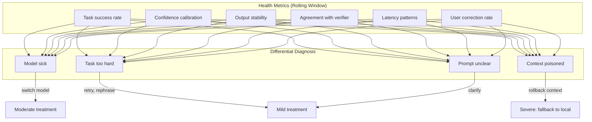
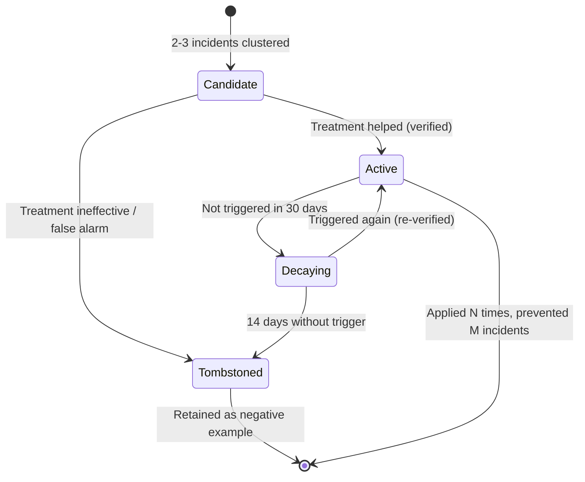
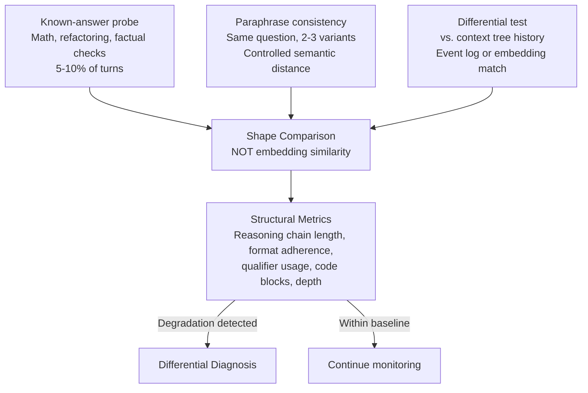
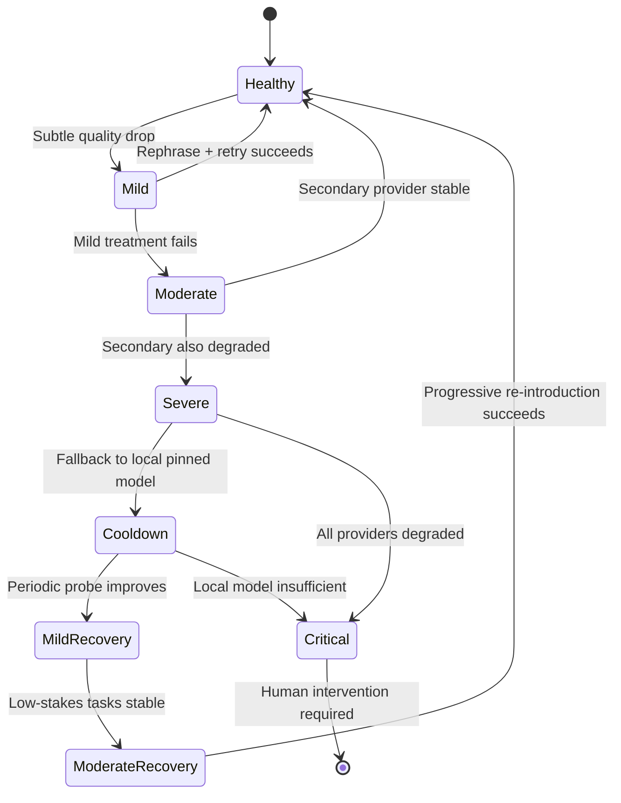

# The LLM Psychologist: Catching Model Drift Before It Wrecks Your Session (or worse)

All LLM providers face a triple squeeze:

- **Demand is exploding.** Google Cloud's backlog nearly doubled in a single quarter to $460B. Sundar Pichai told analysts: "We are compute-constrained. Our cloud revenue would have been higher if we were able to meet the demand."
- **Compute can't keep up.** GPU lead times run 36-52 weeks. Global DRAM supply can only support ~15GW of AI infrastructure — enough for ~30M heavy agentic users, a fraction of the 1B+ active LLM users. Goldman Sachs projects data center power demand growing 165% by 2030.
- **Power and cooling are hitting physical limits.** Liquid cooling is becoming mandatory as chip power densities outstrip air cooling. Grid capacity is already tapped out in most regions.

Faced with demand they can't serve and hardware they can't build fast enough, providers have only one lever: **reduce compute per token**. Quantization (FP16 → INT8 → INT4). Speculative decoding. MoE routing. A/B traffic shaping. Dynamic batch composition. Each is economically rational. Each saves real compute on real hardware. And each subtly degrades the output you receive — not because the model weights changed, but because everything *around* the weights is being continuously tuned to squeeze more tokens out of the same silicon.

The proof is in the numbers. Anthropic planned for 10x growth in Q1 2026 and got 80x instead — Dario Amodei called it "just crazy" and "too hard to handle." Annualized revenue hit $30B. To absorb even a fraction of that, Anthropic signed a deal with SpaceXAI for 220,000 GPUs and 300 megawatts — roughly doubling their capacity. Plus a 5-gigawatt deal with Google/Broadcom. Plus another 5 gigawatts with AWS. But 80x demand with 2x capacity leaves a 40x gap. Even accounting for some genuine efficiency gains (2-3x throughput from quantization and speculative decoding), the remaining 10-15x has to come from somewhere. That somewhere is quality.

Think of it as lossy compression. BMP to JPEG: 10x smaller, barely noticeable at first glance — until you zoom in. CD audio to MP3: 10x smaller, fine for earbuds — unlistenable on studio monitors. Raw video to H.264: 50x smaller, looks great on a phone — falls apart on color grading. The same economics apply to inference. Each optimization — INT4 quantization, draft-model shortcuts, coarser MoE routing — is a compression pass. The output looks fine on casual inspection. Under stress — complex reasoning, long context, edge-case tasks — the artifacts show. Independent benchmarking has shown ±8-14% day-to-day score swings across major providers. Anthropic confirmed three infrastructure bugs in August-September 2025 that degraded up to 16% of requests. Their own evaluations didn't catch it because "Claude often recovers well from isolated mistakes."

## The Asymmetry: Why They Tolerate What Destroys You

The provider and the user experience fundamentally different realities from the same degradation event.

The provider sees aggregates: tokens served, latency percentiles, benchmark averages, quarterly revenue. A 5% quality drop across millions of sessions is a line item — unfortunate but manageable, especially when no lawsuit has ever held an AI provider liable for degraded model quality. The ToS says tokens were delivered. Quality is not part of the contract. No SLA covers "model feels dumber today." No refund for "my agent produced garbage for 20 minutes before I noticed." As long as benchmarks stay above water and churn stays below thresholds, the degradation is invisible at scale.

The user sees something else entirely. You're a software architect in the middle of a complex refactoring — 40 turns deep, the model has learned your codebase conventions, understood the dependency graph, and is making precise, context-aware edits. Then, somewhere around turn 45, the quality drops. Subtle at first — a variable name that doesn't match your convention, a test that tests the wrong thing. By turn 50, the model is confidently producing code that contradicts decisions from turn 20. You don't notice immediately because you trust the model — it was excellent 10 minutes ago. By the time you catch it, the last 10 turns of output are contaminated. Some of those changes were already committed. Now you're not just debugging — you're auditing your own agent's work, trying to figure out which of the recent changes are solid and which are artifacts of a degraded model that was nodding along instead of thinking.

This is the crux. For the provider, a degradation event is a statistical blip averaged across a billion requests. For the professional — the researcher running a multi-day analysis, the engineer mid-refactor, the architect evaluating trade-offs — that same event can invalidate hours of accumulated work. The precious context you built together with the model, the shared understanding of intent and constraints, the momentum of a productive session — all of it poisoned by a quality regression you had no way to detect until it was too late.

The asymmetry is structural. Providers optimize for the median session. Professionals live in the tail — the complex, high-stakes, long-running sessions where model quality matters most and degradation is most destructive.

This is a classic **principal-agent problem**. The provider (agent) can measure cost-per-token precisely and cheaply. The user (principal) can only measure quality degradation poorly and expensively — after the damage is done, through manual auditing of contaminated output. The natural economic gradient pulls providers toward cost optimization while staying just above benchmark thresholds, because benchmarks are what they can measure and what drives customer acquisition. Individual users have no statistical power to prove drift: "my session went bad" is anecdotal, not evidence. The psychologist layer is the mechanism that gives the principal measurement capability comparable to the agent's cost measurement — turning an invisible quality gradient into observable, quantifiable data.

## The Missing Capability: Real-Time Quality Monitoring

What's missing is a **real-time monitoring layer** that tracks model performance and quality as you use it — not benchmark averages, but *your* session, *your* task types, *your* context. Something that measures behavioral markers turn-by-turn, compares them against baselines, and notifies both the human and the agent the moment quality drops below acceptable thresholds. Not after the session is ruined. Not after 10 turns of contaminated output. In real time, early enough to switch models, rollback context, or pause the autonomous loop before the damage compounds.

Today, no such capability exists. The provider won't build it — degradation is invisible in their aggregates. The user can't build it — they don't have access to the inference stack. The gap is real, and the sections below describe what it would take to fill it.

## The LLM Psychologist

The closest analogy for what's needed isn't from software engineering. It's from mental health.

A clinical psychologist doesn't rewire the brain. They observe behavior, form hypotheses about what's wrong, test those hypotheses with targeted questions, and prescribe treatment. They distinguish between conditions that look similar but require different interventions — depression vs. burnout vs. thyroid imbalance all present as low energy, but the treatment is fundamentally different for each. They maintain longitudinal records: this patient's baseline, their patterns over time, what worked and what didn't in previous episodes.

That's exactly what LLMs need. Not a debugger (the code isn't yours). Not a profiler (you don't have access to the inference stack). But a **psychologist** — a separate, simpler system that observes the model's behavior from the outside, detects changes from established baselines, forms differential diagnoses about what's causing the degradation, and prescribes the right treatment. The model is the patient. The psychologist is the monitor.

The analogy is deliberate and the structure follows directly. The sections below describe how it would work: diagnosis, behavioral markers, measurement techniques, and treatment protocols.

## Differential Diagnosis: Four Things That Go Wrong

When agent quality deteriorates, the cause could be one of four fundamentally different problems — and the treatment differs for each:

| Diagnosis | Symptoms | Treatment |
|---|---|---|
| **Model sick** | Degradation across tasks, across contexts | Switch provider/model, cooldown |
| **Task too hard** | Degradation specific to task type | Add context, rephrase, increase reasoning budget |
| **Context poisoned** | Degradation only with current context; clean context → normal | Rollback context tree, selective commit |
| **Prompt unclear** | Degradation resolves on rephrase | Elicit clarification from user |

Without correct diagnosis, you prescribe treatment for the wrong disease — switching models where you should have rolled back context, or rephrasing where the model itself has degraded.

## Behavioral Markers: A DSM for LLMs

Beyond aggregate metrics, specific behavioral markers signal degradation:

| Marker | Symptoms | Detection |
|---|---|---|
| **Irritability** | Terse responses, dropped elaboration, missing code examples | Response length drops N× below baseline for same task class |
| **Avoidance** | Refusals on previously-OK tasks, increasing hedges | Refusal rate rise + provider error correlation |
| **Mania** | Verbose hallucination, confident assertions without grounding | Confidence/accuracy divergence, length explosion |
| **Confusion** | Internal contradictions, persona breaks, lost context | Self-consistency check failure |
| **Depression** | Excessive hedging, refuses to commit, everything is "maybe" | Uncertainty markers where assertions were confident |
| **Compliance regression** | JSON schema breaks, markdown structure fails | Format validation failure rate |

Each marker has: detection rule + severity level + diagnostic hypothesis + recommended action. Example: "irritability + agreement-with-verifier dropped → probable provider drift, severity moderate, action: switch to secondary provider, schedule health re-check for primary in 24 hours."

The markers are deliberately clinical in naming because the monitoring logic mirrors psychiatric diagnosis: observe behavioral changes, form differential hypotheses, test with probes, prescribe treatment.

### Marker Evolution: From Textbook to Clinical Experience

The marker catalog above is a starting point — generic symptoms that any LLM might exhibit. But the real value emerges over time, as the catalog **evolves through the same mechanism as supervisor knowledge**.

Every incident where the psychologist detected degradation and the treatment helped becomes a positive example for the marker pattern. Every false alarm — the psychologist flagged something that wasn't actually wrong — becomes a negative example. Over time, the catalog accumulates realistic clinical experience specific to the models and providers you actually use, not generic textbook symptoms. It becomes a **personalized clinical baseline for each patient**.

This is what separates a static ruleset from a learning system. Without evolution, the psychologist has the same sensitivity on day 100 as on day 1 — it can only catch what the original catalog anticipated. With evolution, the catalog develops sensitivity to the specific drift patterns of your actual providers: Claude 4 might develop a characteristic "irritability + longer latency on code tasks" pattern that isn't in any textbook, but shows up consistently in your usage. The catalog learns this pattern, and future detection gets faster and more accurate.

The mechanism mirrors the supervisor's rule lifecycle from [article 02](./02-closing-the-control-loop.md): candidate markers from 2-3 incidents, promotion to active after verified effectiveness, decay when not triggered, tombstoning as negative examples. The same lifecycle semantics across both systems — unified aging, unified validation.

## Stealth Probes and Shape Comparison

The psychologist doesn't announce tests. It weaves diagnostic probes into normal interaction through three complementary techniques:

**Known-answer probing.** Basic math, refactoring tasks, factual checks — scattered across 5-10% of turns. The model doesn't know it's being measured, so gaming is excluded. Results are compared against historical baselines.

**Paraphrase consistency testing.** The same question in 2-3 variants with controlled semantic distance. A healthy model gives substantively consistent answers — different words, same conclusions, same caveats. Drift manifests as divergent conclusions on equivalent paraphrases. The test is calibrated by generating paraphrases with known semantic distance, not by asking completely different questions and hoping for consistent answers.

**Differential testing against the context tree.** This is where the [context tree from article 01](./01-why-agents-waste-context.md) becomes essential for health monitoring. The psychologist takes a similar past query — either an exact match through the event log, or a semantic match through embeddings — and compares how the model answered then vs. now. The comparison is **structural, not semantic**: reasoning chain length, structural elements (code blocks, tables, lists), qualifier usage, format adherence, depth of analysis. If a same-class question previously got an 800-token structured response with 3-step reasoning and now gets a 200-token bullet list without reasoning — that's a structural degradation visible without any semantic analysis.

This is why shape comparison matters more than embedding similarity for drift detection. Embedding similarity catches surface variance — the model said the same thing in different words. Shape comparison catches structural degradation — the model said something shallower, with less reasoning, in a different format. The former is noise. The latter is the signal that matters.

A local pinned model doesn't drift — weights stay fixed until you change them. This makes it an ideal verifier for critical points: the frontier provider generates, the local model checks. Provider drift gets caught at the verification layer instead of silently leaking into outputs.

## Treatment Protocols

| Severity | Response | Cost |
|---|---|---|
| **Mild** | Rephrase prompt, tweak temperature, retry | Low |
| **Moderate** | Switch model variant or provider; route to secondary | Medium |
| **Severe** | Fallback to local pinned model (less capable but deterministic) | High capability loss, zero drift |
| **Critical** | Pause autonomous operation, escalate to human | Full stop |

**Cooldown / hospitalization.** When a model deteriorates, it goes into recovery — the agent stops sending work to it. Periodic recovery testing with small known-answer queries checks if health has returned. Graduated re-introduction: first low-stakes tasks, then progressively harder if stable.

**Patient passport.** Persistent behavior log for each model/provider/task-type combination over time. The router chooses not "best model in theory" but "model that's been stable on this task type in recent weeks." With multiple providers and models, you don't depend on any single one being healthy right now.

## The Meta-Recursion Constraint

The psychologist itself could be an LLM with its own stability issues. The solution is a fundamental principle of reliable monitoring: **the monitor must be simpler than what it monitors.** No frontier reasoning in the psychologist role — statistical health metrics + rule-based escalation + minimal LLM calls on simple diagnostic tasks, ideally on a pinned local model. The psychologist works precisely because it is smaller and more stable than the patient, operating on observable signals rather than trying to understand internal state. Same principle as a watchdog timer in embedded systems — a separate chip, not a process on the main CPU.

## What This Enables

With a psychologist layer in place, the system gains something no amount of prompt engineering can provide: **detection of provider drift before it destroys accumulated context.** The frontier model can silently degrade — quantization can tighten, routing can shift, distillation can compress — and without active monitoring, you'd never know until the session is already ruined. The psychologist catches degradation early enough to route around it, preserving the context you've built and keeping the session productive.

## The Cost of Not Knowing

The ROI of a psychologist is inverted — it measures what you lose without one:

| Cost dimension | Without psychologist | With psychologist |
|---|---|---|
| **Wasted tokens** | Agent continues producing contaminated output for 10-50 turns before human catches it. At $15/M tokens, a single undetected degradation event costs $5-30 in garbage inference. | Degradation caught within 1-3 turns. $0.50-2 in wasted tokens. |
| **Lost context** | 40-100 turns of accumulated context poisoned beyond recovery. Session must restart from scratch. Hours of work lost. | Early detection → rollback to last-known-good state, context preserved. |
| **Trust erosion** | Every silent degradation makes the user trust the agent less. "I'll just do it myself" — the agent becomes a liability instead of a tool. | Agent remains trustworthy because failures are caught and communicated transparently. |
| **Contaminated deliverables** | Buggy code committed, incorrect analysis delivered to stakeholders, wrong architectural decisions baked in. Downstream cost is unbounded. | Contaminated output flagged before it leaves the session. Human reviews only the flagged turns, not the entire session. |
| **Time spent auditing** | User must manually audit all recent agent output to find where degradation started. 30-60 minutes of unproductive detective work per event. | Psychologist identifies the exact turn where quality dropped. Audit scope: 1-3 turns, not 50. |
| **Repeated mistakes** | Without memory of past degradation events, the same model gets trusted again under the same conditions. Same trap, different day. | Patient passport tracks which providers degraded when, on which task types. Router avoids known-bad combinations. |

A professional running 5-10 agent sessions per day, hitting a degradation event once every few days, loses 2-5 hours per week to contaminated output audits, restarted sessions, and rework. That's not a rounding error — it's a full day of productive time per week evaporated into a problem the provider won't acknowledge and the user can't prevent.

## The Benchmark Arms Race (And Why Open Methodology Wins)

Yes, LLM providers will try to game the monitoring. CPU and GPU manufacturers have optimized for benchmarks for decades — turbo frequencies that only sustain for seconds, drivers that detect benchmark workloads and switch to special code paths, thermal profiles tuned for reviews not real workloads. The same dynamic will play out: providers will tune their inference stacks to perform well on known diagnostic probes while degrading on everything else.

The defense is the same one that eventually worked in hardware: open, community-maintained methodology. Asymmetric cryptography isn't trusted because the algorithm is secret — it's trusted because it's public and still can't be broken. A psychologist layer with open-source behavioral markers, publicly shared probe methodologies, and community-aggregated reliability data creates the same dynamic. Any single provider can optimize around a fixed test suite. They cannot optimize around an evolving, community-driven measurement framework that adapts faster than their quantization schedules.

The endgame isn't a perfect monitoring system. It's a return to rough fairness — the same way open benchmarks forced GPU manufacturers to optimize for real workloads instead of review scores. Not perfect, but far better than trusting the provider to grade their own homework.

Step back from the architecture, and a pattern emerges: this entire system looks familiar.

---

*Part of [Building the Agentic Operating System](./00-index.md) · Previous: [The MCP Hub](./03-the-mcp-hub.md) · Next: [It's Just Engineering Management](./05-just-engineering-management.md)*
