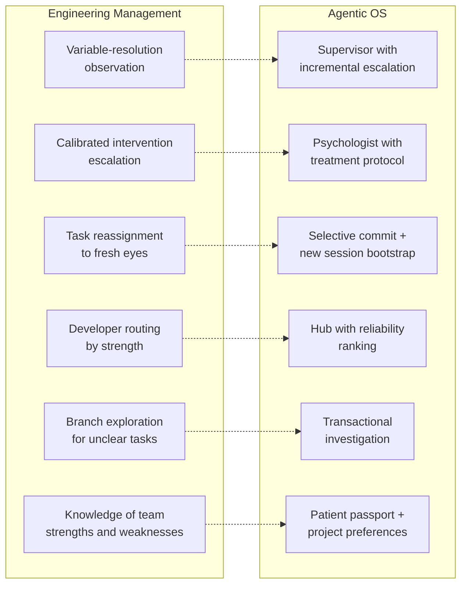
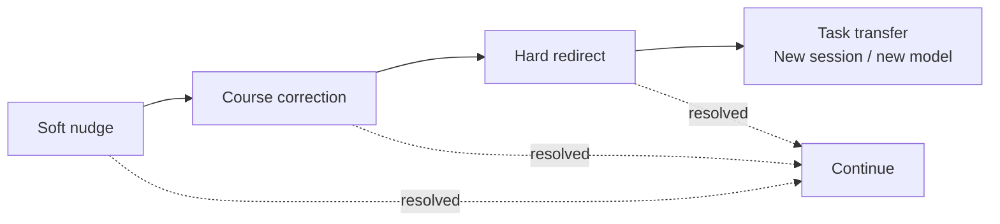

# It's Just Engineering Management

The previous four articles described a stack of infrastructure layers for AI agents: [context compaction](./01-why-agents-waste-context.md) to keep the context window lean, [supervisor and enforcement](./02-closing-the-control-loop.md) to catch problems in real time, [the MCP Hub](./03-the-mcp-hub.md) to orchestrate tools without context bloat, and [the LLM Psychologist](./04-the-llm-psychologist.md) to detect model degradation before it wrecks your session. Each layer solves a specific problem. Each was presented as a novel architectural component.

But here's the thing: none of these components are novel. Every single one has a direct analog in how experienced engineering managers operate. This isn't a metaphor — it's a literal translation of known management practices onto a different substrate. The supervisor is what a good EM does when they notice a developer going off track. The psychologist is what a good EM does when they sense a team member is burnt out. The hub is what a good EM does when they assign tasks based on who's proven reliable at what. The compaction layer is what a good EM does when they ask "give me the summary, skip the investigation trail."

Once you see the mapping, the reason current agent stacks fail becomes obvious: they're missing the management layer entirely. Nobody would run a software team without observation, intervention, escalation, and knowledge accumulation. Yet that's exactly how every agent framework operates today — launch the model, wait for output, hope for the best.

The diagram below shows the full correspondence:

Six management practices. Six architectural components. Direct correspondence. The sections below walk through each one.

### Variable-Resolution Observation

When a developer is working normally, a good EM doesn't micromanage every action. But when something starts going sideways, the EM sharply increases resolution: examining specific commits, reading reasoning in PR descriptions, asking for explanations. This is exactly what the supervisor does with incremental escalation — moving from passive observation to active probing as anomalies accumulate.

| EM Behavior | Agent Equivalent | Trigger |
|---|---|---|
| Casual check-in | Supervisor passive observation | Normal operation |
| Reading PR descriptions | Supervisor event log scan | Minor anomaly detected |
| Sitting down for detailed review | Supervisor active pattern analysis | Repeated failure pattern |
| Pair programming session | FSM stream monitoring + corrective injection | Critical operation |

### Calibrated Intervention Escalation

First a soft nudge ("did you account for X?"). Then explicit course correction ("you're going the wrong way"). Then something harder ("stop, sit down, let's figure this out"). If nothing helps — you don't keep bashing the same person's head against a wall, you transfer the task.

The cost asymmetry drives everything: intervening at early symptoms is cheaper than allowing five days of brute-forcing a dead-end approach. Twenty minutes of redirection can save hours of wasted work. This is as true for LLM agents as it is for human developers.

### Task Transfer to Fresh Eyes

The most frequent and most effective move in real management practice. When a person "gets stuck" — context is poisoned, frustration has accumulated, they're going in circles — you remove them from the task and hand the description plus relevant context to someone with fresh eyes. Often the problem dissolves in twenty minutes on a new session.

| Management Action | Architecture Component |
|---|---|
| Extract key insight from failed attempt | Selective commit (distillation) |
| Discard noise of failed investigation | Transaction rollback |
| Hand clean task description to new person | New session bootstrap with compact preamble |
| Choose different person based on task type | Model/provider routing through hub |

### Knowing Your Team

Over time, an EM accumulates knowledge about each team member: "X is good at backend but bad at UI," "Y can't handle open-ended tickets." This is the patient passport plus project-specific tool preferences — accumulated behavioral knowledge that informs routing decisions.

### Routing by Strength

Good EMs don't assign tasks randomly. They know that this developer works fast on CRUD but struggles with algorithms, and route accordingly. The hub does the same for models and tools: reliability stats per task type, project-specific track records, global performance baselines. Instead of routing to whichever model happens to be configured, the hub routes to whichever model has proven most reliable for this specific type of work on this specific project.

### Branch Exploration for Unclear Tasks

When the requirements are ambiguous or the approach is uncertain, experienced EMs don't force a single path. They say: "try two approaches in parallel, show me both in two days." The one that works wins; the other becomes a negative example. Transactional investigation does exactly this: spawn N independent agents with different models/prompts/temperatures, let each explore, verify results independently, commit the winner and keep losers as fallback. The cost of running two agents is a fraction of the cost of going down the wrong path for a week.

## Management Cannot Operate in a Vacuum

None of these six practices work without information. A real EM doesn't intervene on gut feeling — they intervene because they *noticed* something: a commit message that doesn't match the ticket, a PR that took three times longer than estimated, a developer who stopped asking questions. The intervention is only as good as the signal that triggered it.

This is the part the agent ecosystem consistently misses. It's tempting to imagine a "manager agent" that watches everything and makes smart decisions — but a manager who receives no structured input can only guess. The manager needs:

- **Prepared signals** from the supervisor: behavioral markers, quality trends, anomaly scores — not raw conversation logs to sift through
- **Triggers for escalation**: predefined thresholds that say "this is no longer a nudge situation, this is a hard redirect" — the FSM state transitions that move from passive to active to critical
- **Context distilled by others**: the compaction layer's summary, the verifier's pass/fail, the hub's reliability stats — each component produces a concise signal, not the full firehose
- **Permission to act**: escalation authority that says "you may intervene here, and you must escalate there" — without it, the manager observes helplessly

In a real engineering organization, the EM doesn't personally review every line of code, run every test, and monitor every dashboard. They rely on CI pipelines, code review culture, sprint metrics, and team leads who surface problems early. The EM's job is to synthesize, decide, and act — not to personally gather all the raw data.

The agentic OS needs the same division of labor. The supervisor observes and escalates. The psychologist detects degradation patterns and produces a diagnosis. The compaction layer distills what matters. The hub tracks reliability. Each component feeds structured, compressed signals into the management layer. The manager agent — or whatever we call the orchestrator — synthesizes those signals and decides: nudge, redirect, transfer, or escalate to human.

Without that signal pipeline, a manager agent is just another LLM consuming context and guessing. With it, the management practices above become deterministic — triggered by data, not by vibes.

## Why Current Agent Stacks Are So Bad

Current agentic frameworks treat LLMs as cron jobs: launch, get output, move on. No supervision, no intervention, no escalation. This is equivalent to an engineering manager who starts a developer on a two-week sprint, goes on vacation, and is surprised by the results.

**The management vacuum is the problem.** Hours of brute force without observation, intervention, or rollback — this is default mode, not aberration. And the industry's response has been to make models smarter rather than to manage them better — building a bigger brain instead of building team management around the brain.

## The Community Is Trying (And Getting Close)

The ecosystem isn't standing still. Two open-source projects in particular have made the most visible progress toward solving the management gap — and their trajectories reveal both what's possible and what's still structurally missing.

### OpenClaw: The Agent Runtime That Proved the Gap Exists

[OpenClaw](https://github.com/openclaw/openclaw) (originally Clawdbot, launched 2025) became the fastest-growing open-source project in GitHub history — 100K stars in 48 hours, 355K within five months. A self-hosted AI agent that connects to 50+ messaging platforms, supports model-swapping, durable TaskFlows, and a plugin ecosystem. By mid-2026, OpenClaw stopped being a chatbot wrapper and became an agent runtime: tasks, tools, memory, channels, permissions, subagents, and model choices composed into durable workflows.

OpenClaw has the most sophisticated context lifecycle in any consumer agent — auto-compaction, memory flush, pluggable summarization providers, session pruning. It has TaskFlows for durable multi-step workflows, model-swapping, subagents, and a plugin ecosystem. And yet: **none of this is management.** OpenClaw can compress what happened. It cannot observe *whether the model is degrading mid-session*, intervene when the agent goes off-rails, transfer the task to a fresh context, or enforce budget envelopes. It proved that agents work. It also proved that the gap between a personal assistant and a reliable engineering partner is a *management* problem, not a context size problem.

### OpenCode + Oh My Opencode: The Orchestration Layer That Almost Manages

[OpenCode](https://github.com/opencode-ai/opencode) (now continuing as Crush) took a different path: a terminal-based AI coding agent with multi-provider support, session management, and LSP integration. What made it consequential was its plugin ecosystem, and the most ambitious plugin by far is [Oh My Opencode](https://github.com/opensoft/oh-my-opencode) (also known as oh-my-openagent or "omo").

Oh My Opencode introduces **Sisyphus** — an orchestration agent that coordinates a team of specialized sub-agents: Oracle for design and debugging (GPT 5.2), Frontend Engineer for UI/UX (Gemini 3 Pro), Librarian for documentation and codebase exploration (Claude Sonnet), and Explore for fast codebase search (Grok Code). Each agent has different permissions, prompts tuned per model family, and explicit tool boundaries. Sisyphus delegates by category (`deep`, `visual-engineering`, `ultrabrain`, `quick`), and the system auto-routes to the right model.

This is genuinely impressive — and it's the closest the ecosystem has come to the management layer this article describes. But map it against the six practices in the diagram above:

| Management Practice | Oh My Opencode | Status |
|---|---|---|
| Variable-resolution observation | Sisyphus monitors sub-agent outputs | Partial — observes results, not degradation patterns |
| Calibrated intervention escalation | Todo Continuation Enforcer forces agents to finish | Partial — forces completion, doesn't detect quality collapse |
| Task transfer to fresh eyes | Session pool with server-side compaction reset | Partial — resets context, doesn't distill insights from failed attempt |
| Routing by strength | Category-based model routing with fallback chains | **Exists** — the strongest mapping in any current system |
| Branch exploration for unclear tasks | Parallel async agents via `task()` | **Exists** — category-based delegation to concurrent agents |
| Knowledge of team strengths | Model-specific prompts, per-family behavior tuning | Partial — knows prompt compatibility, not reliability track record |

Two out of six, with partial coverage on four more. The routing and parallel exploration pieces are real and functional — Oh My Opencode legitimately routes work to the model best suited for it. But what's missing is the *observation and intervention loop*: the system doesn't detect when a model degrades mid-session, doesn't notice that an agent has been spinning for 30 minutes on a dead end, doesn't have the equivalent of an EM sitting down for a concerned one-on-one. Sisyphus is an excellent dispatcher. It is not yet a manager.

### Why "Better Prompts" Won't Close the Gap

Both projects represent the current best-in-class for community agent infrastructure. Both are evolving fast. And both share a structural limitation: **they solve orchestration but not governance.** OpenClaw compresses context after the fact. Oh My Opencode dispatches work to the right model. Neither one watches the model's output quality in real time, intervenes when quality drops, or maintains a longitudinal record of model reliability per task type.

The community is building better dispatchers and better compressors. What's missing is the management layer — the EM who watches, notices, intervenes, and transfers. That layer cannot be a plugin. It cannot be a prompt. It needs to be architectural: a separate observation channel with its own model, its own escalation logic, and its own memory of what went wrong last time.

## Hard Enforcement Mechanisms Still Missing

Beyond the management analogies, the architecture needs organizational discipline — structural constraints that compel good behavior through architecture rather than persuasion.

### Parallel Competing Teams

Same task, N independent agents with different models, prompts, and temperatures. Independent verifier judges results. Winner commits, losing branches kept as fallback and negative examples. Especially valuable for high-stakes decisions where cost of wrong far exceeds N times cost of right.

### Deep Specialization

Currently, every role uses a generic frontier model. What's needed: narrowly fine-tuned local models for specific domains — code review specialist, security audit specialist, SQL specialist. Primary agent delegates to specialists through hub. A specialist is both cheaper than a frontier model and more accurate in its domain.

### Veto Authority

The verifier and psychologist currently advise but have no veto. For production deployments, financial actions, irreversible state changes, data deletion, and security-sensitive operations, there should be a **hard block without verifier signature.** This is enforcement through separation of powers — not observability but authority.

### Deadlines as Forcing Function

Current agent stacks have no explicit time or budget envelope on operations — agents can spin for hours without constraint. Each task needs a budget: tokens, time, number of tool calls. At 50% consumed, a soft warning. At 80%, mandatory reflection. At 100%, forced yield to human or return current state. This isn't cost-cutting — it's a forcing function for prioritization and cure for rabbit holes.

### Mandatory Postmortems

On every task escalation to human, significant failure, or user-flagged issue: mandatory structured postmortem with timeline, root cause hypothesis, contributing factors, and preventive recommendations. Postmortems feed back into supervisor rules, FSM patterns, and marker catalog entries. They are the primary source of system evolution.

### Reputation-Driven Routing

Long-term reputation per model/provider/specialist with confidence intervals and recency decay. Proven performers get critical tasks first. Agents consuming lots of compute without results lose access to expensive resources on cooldown. No model is "entitled to top tasks" — everything is earned through track record.

## Hard vs. Soft Enforcement Summary

| Mechanism | Soft (Current) | Hard (Needed) |
|---|---|---|
| Quality control | Verifier suggests | Verifier has veto on designated operations |
| Task execution | Agent chooses approach | FSM enforces hub-query-first for known patterns |
| Resource allocation | Flat model tier everywhere | Dynamic criticality-based routing |
| Time management | No limits | Explicit budget envelopes with forced yield |
| Competition | Single approach per task | Parallel competing agents for high-stakes decisions |
| Specialization | Generic model for everything | Domain-specialist agents with fine-tuned models |
| Learning from failure | Passive observation | Mandatory structured postmortems |
| Team composition | Static routing | Reputation-driven dynamic routing |

The pattern is clear: same engineering problems, same solutions, different substrate. And this insight extends beyond the tactical layer — while we're building management infrastructure for agents, the models themselves raise their own architecture questions.

## The Cost of Unmanaged Agents

Every missing management mechanism has a price. The ROI of this article is what you stop losing:

| What's missing | What happens | Cost per incident | Frequency (heavy user) | Weekly cost |
|---|---|---|---|---|
| **No supervision** | Agent spends hours brute-forcing a dead-end approach. Nobody notices until the human checks in. | 2-6 hours of wasted inference + human wait time | 2-3x/week | $30-180 in tokens + 4-10 hours |
| **No intervention** | Agent goes off-rails and compounds errors for 20+ turns before the output becomes obviously wrong. | 50-100K tokens of garbage + 30-60 min audit | 3-5x/week | $15-75 in tokens + 2-4 hours |
| **No task transfer** | Stuck agent keeps spinning in the same poisoned context. Fresh start would solve it in minutes but nobody triggers one. | 1-2 hours of futile inference + eventual manual restart | 1-2x/week | $10-60 in tokens + 1-3 hours |
| **No budget envelopes** | Agent burns through 200K tokens on a task that needed 20K. No forced yield, no reflection checkpoint. | 5-10x token overconsumption | Daily | $20-100 in tokens |
| **No postmortems** | Same failure pattern repeats every week. The system never learns — every session starts as blank as the last. | Repeated identical failures × weeks | Ongoing | 2-5 hours/week of avoidable rework |
| **No reputation routing** | Agent keeps using a model that's been unreliable for this task type. No memory of past failures. | Degraded output quality + rework | 2-3x/week | $10-50 in tokens + 1-2 hours |
| **No veto authority** | Agent commits irreversible changes (schema migration, data deletion) without verification. Downstream damage is unbounded. | Production incident or data loss | Rare but catastrophic | $500+ per incident |

A professional relying heavily on agents loses **10-25 hours per week** to problems that engineering management practices solved decades ago — supervision, intervention, task transfer, budget enforcement, postmortems, and reputation tracking. That's 25-60% of a workweek spent compensating for the absence of a management layer.

The pattern is literally the same one that played out in software teams: unmanaged developers waste enormous amounts of time on dead ends, rabbit holes, and repeated mistakes. The fix wasn't smarter developers — it was management. The fix for agents isn't smarter models. It's the same management, applied to a different substrate.

## The Agentic OS RACI Matrix

Putting it all together, here's who does what across a single task lifecycle. Every row is a moment where an unmanaged agent fails silently today — and every row has a clear owner in the architecture:

| Event | Supervisor | Psychologist | Compaction | Hub | Manager / Orchestrator | Human |
|---|---|---|---|---|---|---|
| **Task starts** | Begins passive observation | — | Loads compacted preamble from prior session | Routes to best model for task type | Sets budget envelope, defines success criteria | Provides task description |
| **Normal execution** | Streams output, collects behavioral markers | — | — | — | Monitors budget consumption | — |
| **Minor anomaly** | Escalates resolution, scans event log | — | — | — | Receives signal, continues monitoring | — |
| **Quality degradation suspected** | Feeds stream to psychologist | Analyzes markers, produces diagnosis | — | — | Receives diagnosis, decides whether to continue or redirect | — |
| **Agent stuck in loop** | Detects repetition pattern | Confirms: degradation or dead-end? | — | — | **Triggers task transfer**: selective commit, new session, different model | — |
| **Budget at 80%** | — | — | — | — | Forces reflection checkpoint | — |
| **Budget exhausted** | — | — | — | — | Forces yield: return current state or escalate | **Receives state, decides** |
| **Irreversible action pending** | — | — | — | — | Requires verifier signature | — |
| **Verifier rejects** | — | — | — | Routes to alternative model/specialist | Redirects or spawns parallel investigation | — |
| **Task completes** | Logs outcome, updates behavioral profile | Updates model reliability record | Distills session, prepares preamble for next session | Updates reliability stats per model/task type | Archives, records postmortem if flagged | Reviews result |
| **Recurring failure pattern** | Feeds pattern into FSM rules | Updates diagnostic catalog | — | Adjusts routing weights | Triggers mandatory postmortem | Approves system evolution |

Every cell in this matrix is either a signal producer or a decision maker. The supervisor and psychologist produce signals. The manager/orchestrator makes decisions. The compaction layer and hub provide context and routing. The human is the final escalation point — not the first responder.

The key insight: **nobody watches everything, and nobody acts alone.** Each component owns a narrow, well-defined slice of the management lifecycle. That's how real engineering organizations work. That's how the agentic OS should work.

---

*Part of [Building the Agentic Operating System](./00-index.md) · Previous: [The LLM Psychologist](./04-the-llm-psychologist.md) · Next: [Why Monolithic Models Won](./06-monolithic-models-vs-specialized-experts.md)*
