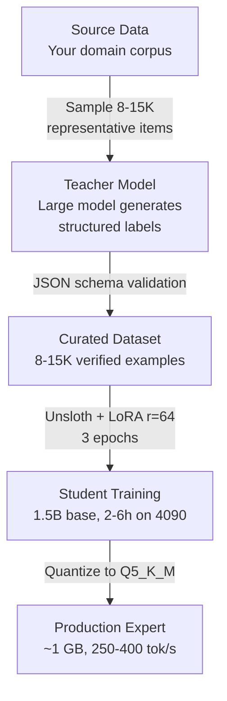

# Why Monolithic Models Won (And Specialized Experts Are Coming Anyway)

Why do frontier labs keep building ever-larger trillion-token models that cram every language and modality into one monolith? Why not build a hundred specialized expert models on a shared bus and load only what you need?

The answer: the industry is already doing exactly that. Just not at the granularity you might expect. And for local inference, the expert-loading approach might actually be the right one.

## MoE Already Does This (At a Different Scale)

Mixture-of-Experts architectures like DeepSeek-V3, Mixtral, and (reportedly) GPT-4 are built around the "load only what you need" principle. DeepSeek-V3 has 671B total parameters but activates only ~37B per token — a router at each layer selects 8 out of 256 experts. The granularity is just much finer than "Python expert" or "Russian expert." It's at the FFN-block level inside each transformer layer, and routing happens per token, not per request.

The "hundred experts on a shared bus, load only what's needed" — that **is** the architecture of modern frontier models. The bus is just the attention mechanism running in nanoseconds, not PCIe running in milliseconds.

## Why Coarse Domain Experts Fail

The intuitive approach — big, clean domain experts swapped per request — breaks down for four reasons.

**1. Expertise boundaries don't exist where you think.** A question in Russian about debugging Rust code with quantum mechanics references crosses five domains simultaneously. A router smart enough to handle this would itself need broad knowledge — defeating the purpose.

**2. Shared representations enable transfer learning.** Multilingual models understand rare languages better than monolingual ones trained on the same data — semantic structure transfers. Vision-language models reason about geometry better than text-only ones. Splitting by domain kills this transfer.

**3. Swap latency is brutal.** Loading a 70B model into VRAM takes seconds and tens of gigabytes of PCIe traffic. The bandwidth cliff between HBM (~3 TB/s) and PCIe (~128 GB/s) is why MoE keeps all experts in HBM and routes internally.

**4. Emergent capabilities require cross-domain training.** Chain-of-thought reasoning, in-context learning, multi-step inference — these appear only at scale with diverse training. A hundred isolated specialists don't compose into a system that can reason.

## The Local Inference Exception

Everything above argues from the perspective of production serving with continuous batching on H100 clusters. But for local inference — a single user, batch size 1, where latency of a few seconds is acceptable — the calculus flips entirely.

For a homelab setup, VRAM is the bottleneck, not throughput. Lazy-loading experts makes perfect sense, and it's already working:

- **ktransformers** runs DeepSeek-V3 (671B, 37B active) on a single 4090 + 384GB DDR5. Router and attention stay resident in VRAM; experts stream from RAM on demand. 8-14 tokens/second — viable for agentic workflows.
- **llama.cpp** offers flags for selective tensor offloading to CPU. Ready-made configs exist for Qwen3-235B-MoE and DeepSeek.
- **PowerInfer** keeps hot neurons on GPU, cold ones on CPU, with predictive prefetching.

This is exactly the "experts on a shared bus" architecture — built bottom-up by the open-source community, because cloud providers have no incentive to optimize for single-user setups.

## Distilling Your Own Experts

Can you extract specialized experts from existing models without spending millions of GPU-hours? Yes — and it's cheaper than you'd think.

### Three Approaches by Cost

**Expert pruning** (cost: hours of inference, zero training). Profile router activations on your domain data, identify which experts fire frequently, drop the rest. Research shows 50-70% of experts can be pruned with only 1-3% quality loss.

**Expert merging** (cost: minutes). Apply weight arithmetic (TIES, SLERP, DARE) to collapse similar groups. Nearly free, but lower quality than pruning for narrow tasks.

**Classical distillation** (cost: a weekend on a 4090). Generate 10-100K synthetic Q&A pairs from a large teacher, LoRA fine-tune a small student. The quality of synthetic data matters more than compute quantity — Phi-3 and DeepSeek-R1-Distill proved that narrow 7B specialists can match 70B generalists in their domain.

### Recipe Categorization: A Practical Case

Categorizing 165K recipes and normalizing ingredients currently requires a 20-27B model. A 1.5B distillate handles it at a fraction of the cost:

| Metric | Teacher (~27B, Q4) | Student (1.5B, Q5_K_M) | Delta |
|---|---|---|---|
| Working VRAM | 14-18 GB | ~1.1 GB | ~14x smaller |
| Throughput (single) | 25-40 tok/s | 250-400 tok/s | ~10x faster |
| Throughput (batched) | 5-8 recipes/s | 150-250 recipes/s | ~25-40x more |
| Time to first token | 150-400 ms | 20-40 ms | ~7x faster |
| F1 on closed taxonomy | 0.93 | 0.90-0.92 | -1 to 3 pp |
| OOD generalization | Good | Poor | Notable drop |

The student wins on every operational metric and nearly matches quality **within its training distribution**. Where it struggles: out-of-distribution items and taxonomy updates (the student's schema is baked into weights, not adjustable via prompt).

The practical solution: a **two-tier architecture** — cheap student handles 95% of requests, teacher as fallback for low-confidence predictions and new categories.

## What Transfers and What Doesn't

The strategy for building your own expert ecosystem: **many narrow distillates instead of one broad model.**

What transfers cheaply: closed-taxonomy classification, structured extraction, domain-specific formatting, pattern recognition in known domains.

What doesn't transfer: general world knowledge, out-of-distribution reasoning, novel category handling, cross-domain synthesis.

For each narrow domain — recipe categorization, SQL generation, code review, security audit — a small specialist outperforms a large generalist at a fraction of the cost. The "experts on a bus" architecture becomes viable not at the level of the model itself, but at the level of the agent system that routes between them.

The management infrastructure described in the previous articles — the hub, the supervisor, the reputation system — becomes the bus that connects these specialists into a coherent system. And that infrastructure is the real moat.

---

*Part of [Building the Agentic Operating System](./00-index.md) · Previous: [It's Just Engineering Management](./05-just-engineering-management.md) · Next: [Infrastructure Is the Only Moat](./07-infrastructure-is-the-only-moat.md)*
