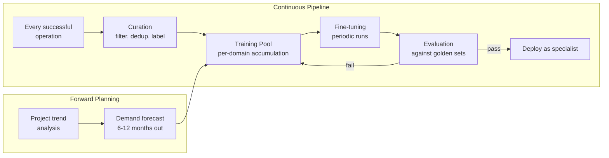

# Infrastructure Is the Only Moat in AI

The operational and tactical layers described in previous articles — shadow compaction, supervisor, psychologist, hub, FSM enforcement — are necessary but insufficient. They solve today's problems. What's entirely absent from current agent stacks is the **strategic** layer: the infrastructure for reproducing, expanding, and evolving agent capabilities over months and years. This is the difference between a "working team" and an "industry."

## Balance Accounting: Knowing Where the Money Goes

There is no **flow-level balance sheet** in any agent architecture today. Each component has its metrics, but nobody tracks the flows between them. Critical questions that can't be answered without balance accounting:

- Are we spending more on supervision than on production?
- Is triage saving context or creating overhead?
- Is the bottleneck in the primary agent, supervisor, verifier, or triage?
- What's the cost-per-outcome across the full stack?

A capability balance sheet — tracking compute, context tokens, latency, and cost across every component and every flow between them — is an analytical layer that doesn't exist. Without it, optimization is blind.

## Capability Roadmaps with Lead Times

Each new agent capability has different development cycles:

| Capability Phase | Duration | Dependencies |
|---|---|---|
| Collecting training data | Continuous, months to years | Instrumented substrate |
| Fine-tuning a specialist | Months | Curated training data, evaluation harness |
| Hub integration and schema | Weeks to months | Schema registry, tool wrapper |
| Supervisor calibration | Months of observations | Event log, pattern detection |
| Psychologist telemetry baseline | Quarter minimum | Health metrics pipeline, marker catalog |
| Production deployment | Weeks | Veto verifier, postmortem procedure, FSM rules |

If "security audit specialist" is needed urgently and starts from zero, the realistic horizon is **6-9 months.** Nobody tracks these lead times. Capabilities are added ad hoc, and surprise at new MCPs behaving strangely in production is the predictable result.

## Continuous Training Pipeline

The substrate should harvest training data automatically — every successful operation in every domain is a potential training example. Curation, deduplication, labeling, quality scoring, and forward demand projection ("what specialists will we need in 6-12 months?") should run continuously, not on-demand.

Currently in the industry this doesn't exist at all — every specialist agent starts from scratch.

## Internal Standards (Schema Registry)

Without unified schemas across components — marker catalog format, postmortem reports, tool effectiveness reports, investigation traces — every integration is custom work and complexity grows quadratically with component count. A schema registry with versioning and backward compatibility rules is the difference between "5 components work together" and "25 components work together."

## Bottleneck Migration Tracking

A pattern from planning literature: the bottleneck in the production chain migrates as capacity expands at the current node. Optimize the foundry — bottleneck moves to machining. Clear that — electrical engineering stops.

The agent processing chain — triage → analysis → design → implementation → review → deployment → monitoring — each node has different throughput. Currently nobody tracks where the bottleneck is now and where it's migrating as components are optimized. Bottleneck tracking as a continuous practice with predictive capacity planning is a separate architectural layer.

## Strategic Reserves

Compute reserve for spikes, context budget reserve for unforeseen escalations, alternate provider standby, API quota reserves for emergency operations, local model capacity guarantee for critical fallback — each resource is currently consumed to exhaustion, and the agent discovers the problem when it hits the wall. Calibrated buffer levels with depletion alarms on every critical resource is infrastructure, not optimization.

## The Non-Replicable Asset

Models can be swapped in an hour. Providers in a day. Frameworks in a week. But months of accumulated operational wisdom cannot be bought, copied, or generated:

| Asset | Acquisition Time | Can Be Copied? |
|---|---|---|
| Frontier model access | Minutes | Yes — same API for everyone |
| Prompting techniques | Hours | Yes — widely published |
| Framework | Days | Yes — open source |
| Project-specific knowledge | Months of use | No — unique to your workload |
| Clinical observations of model behavior | Months of observation | No — unique to your models and tasks |
| Tool effectiveness statistics | Months of usage | No — unique to your projects |
| Behavioral patterns and anti-patterns | Months of incidents | No — unique to your team composition |
| Specialist training data | Months of curation | No — unique to your operations |
| Calibrated supervisor rules | Months of feedback loops | No — unique to your codebase |

The last five items are what the psychologist, supervisor, and hub accumulate over time. They're the difference between having a tool and having craft expertise. They can't be shortcut.

## Why Nobody Builds This

| Actor | Why They Don't Build It |
|---|---|
| Research labs | Grants fund flashy capabilities, not boring infrastructure |
| Providers | Business model is stateless API; customer-side stateful substrate contradicts it |
| Open-source community | Contributors focus on user-visible features, not kernel layers |
| VC-funded startups | Money flows to applications, not infrastructure underneath |
| AI researchers | Incentivized by model breakthroughs, not management breakthroughs |

The industry has been building a bigger brain. The management around the brain — observation, intervention, escalation, knowledge accumulation, strategic planning — remains a vacuum.

## The Honest Starting Point

This isn't a research project — it's engineering of known parts into a coherent system. The challenge is volume and integration, not novelty. Most components exist in some form in open-source. The patterns are proven in both classical OS design and organizational management. No fundamental breakthroughs are needed.

The honest starting point: **selective commit + budget envelopes + local verifier.** These three have the highest ROI per engineering hour, can be prototyped without the full architecture, and provide measurable impact on long agent sessions. Build these, measure the effect, then expand.

An indie project or small team can build a vertical slice — triage + selective commit + local verifier — that's already significantly better than the state of the art in open-source agents. The full architecture is either a well-funded startup, a research lab, or a layer in a large product that matures over several years.

In a world where everyone uses the same frontier models through the same APIs, **infrastructure is the only legitimate moat.** And the accumulated operational wisdom embedded in that infrastructure — the supervisor rules, the psychologist markers, the tool effectiveness stats, the specialist training data — is the non-replicable asset that determines who wins over the long term.

---

*Part of [Building the Agentic Operating System](./00-index.md) · Previous: [Why Monolithic Models Won](./06-monolithic-models-vs-specialized-experts.md)*
